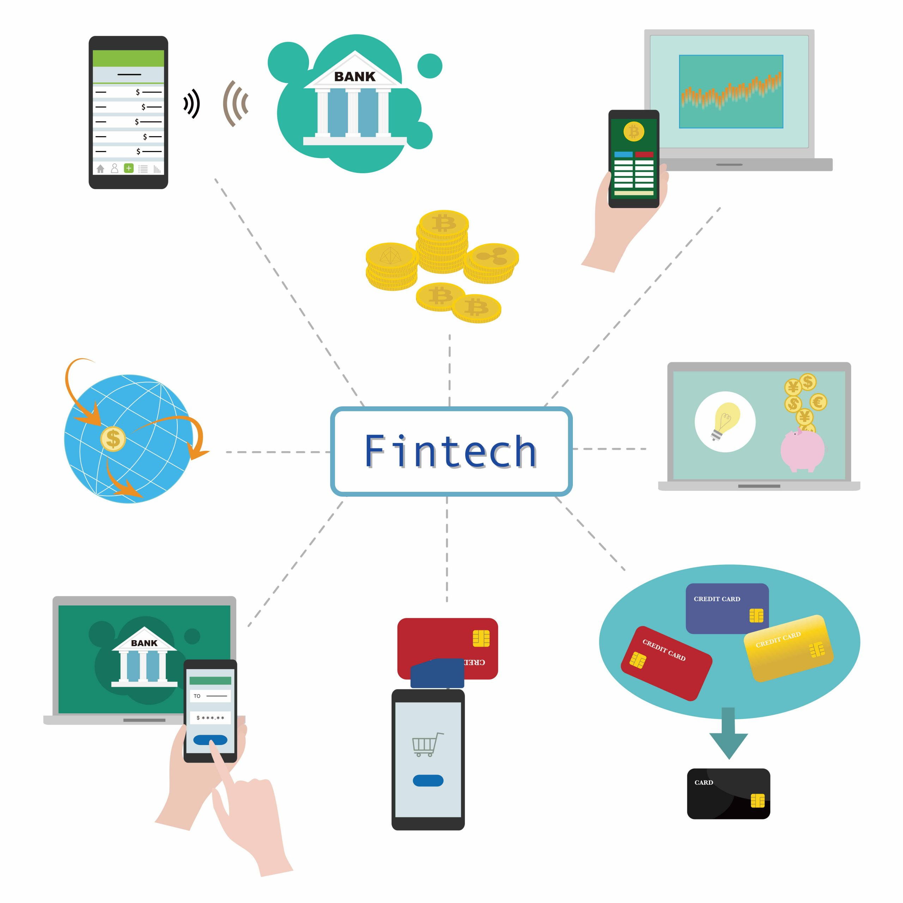

## About

Financial technology (FinTech) refers to the use of innovative technologies to improve and automate financial services and processes. FinTech has revolutionized the way people access and utilize financial services, particularly in India where it has seen rapid growth in recent years.

## Key Aspects of FinTech

- FinTech leverages technologies like computers, smartphones, and the internet to make financial transactions more convenient and accessible for end customers
- It enables new ways of making payments, transferring money, and accessing financial services beyond traditional methods like cash or bank transfers
- FinTech platforms and apps allow for faster, cheaper, and more efficient financial transactions, especially across borders
- Examples include digital payment apps like Paytm and PhonePe, money transfer services like PayPal and Payoneer, and online investment platforms

## Growth of FinTech in India

India has emerged as one of the largest and fastest-growing FinTech ecosystems in the world:

- India ranks second globally in FinTech adoption with an adoption rate of 87%
- The Indian FinTech market is estimated to be worth $50 billion in 2021 and is expected to reach $150 billion by 2025
- India has over 6,600 FinTech startups valued at $31 billion as of 2021
- FinTech funding in India has grown exponentially, with $8 billion invested in 2021 alone

## Impact of FinTech in India

FinTech has significantly impacted the Indian finance ecosystem in several ways:

- Increased financial inclusion by providing access to financial services for underserved and unbanked populations
- Enabled faster, cheaper, and more convenient financial transactions through digital payment platforms like UPI
- Facilitated access to credit for individuals and small businesses through digital lending platforms
- Allowed for easier investment in financial instruments like stocks and mutual funds through online platforms
- Driven innovation and the adoption of new technologies like artificial intelligence and machine learning in the financial sector

Reference:

1 https://en.wikipedia.org/wiki/Financial_technology_in_India

2 https://cleartax.in/glossary/fintech/

3 https://www.sciencedirect.com/science/article/pii/S0016718523000465

4 https://www.pwc.in/industries/financial-services/fintech/fintech-insights/fintech-2-0-a-new-era-of-financial-inclusion.html

5 https://www.investindia.gov.in/sector/bfsi-fintech-financial-services