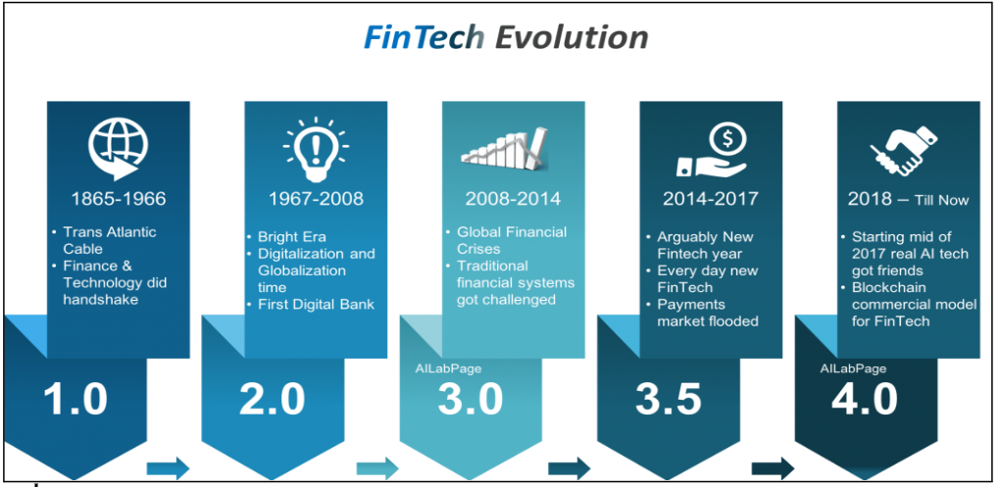

## About

The evolution of financial technology (FinTech) has transformed the way people access and utilize financial services over time. Initially, transactions were conducted through barter systems, cash, checks, and later credit and debit cards. However, with technological advancements, the FinTech industry has introduced innovative solutions that have revolutionized the financial landscape:

- Digital Wallets and Mobile Payment Apps: They have become popular, allowing users to make payments using smartphones, eliminating the need for physical cards and cash. These apps provide convenience and security in transactions, making payments seamless and efficient.

- Cryptocurrencies: The evolution of FinTech in international finance has led to the development of cryptocurrencies like Bitcoin, Ethereum etc. Cryptocurrencies are digital currencies that use encryption techniques to secure transactions. They operate independently of traditional banking systems and offer decentralized governance, providing users with alternative ways to store and transfer value.

- Unified Payments Interface (UPI) in Indian Finances: In India, the evolution of FinTech has introduced the Unified Payments Interface (UPI). UPI allows users to link multiple bank accounts to a single mobile app, enabling seamless and instant fund transfers between individuals and businesses. This innovation has revolutionized the way people in India conduct financial transactions, making payments quick, easy, and secure.

The evolution of FinTech has not only simplified financial transactions but has also paved the way for new forms of digital currencies, payment methods, and financial services that serve towards the changing needs and preferences of consumers in an increasingly digital world.

References:

1 https://timesofindia.indiatimes.com/blogs/voices/evolution-of-fintech-in-india-and-investors-attitude/

2 https://t-hub.co/evolution-of-fintech-in-india-and-emerging-trends/

3 https://panorbit.in/the-evolution-of-fintech-in-india/

4 https://news.abplive.com/technology/
opinion-evolution-impact-of-fintech-in-india-what-fy2024-brought-to-the-table-1669309

5 https://ciiblog.in/fintech-revolution-in-india/