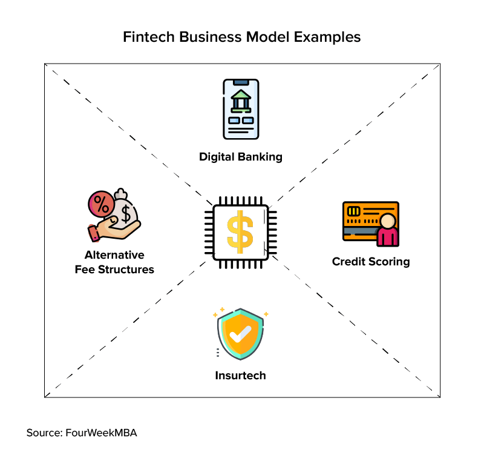
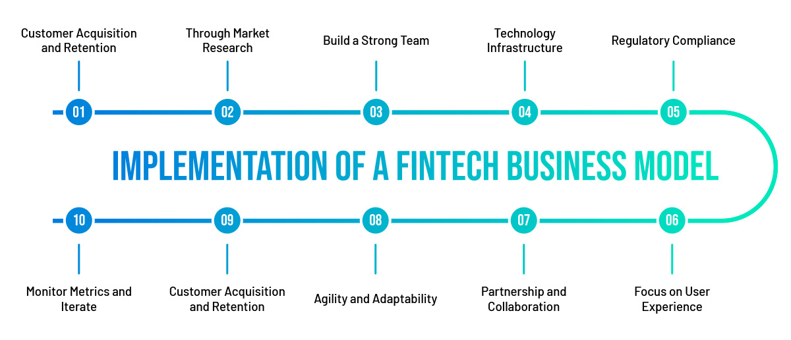

## About

## Peer-to-Peer (P2P) Lending

P2P lending platforms connect individual borrowers directly with lenders, cutting out traditional banking intermediaries. Borrowers can access loans more easily, while lenders can earn returns by investing in loans. Examples include Lending Club and Prosper in the US, and Faircent in India.

## Robo-Advisory

Robo-advisors are online platforms that use algorithms to provide automated, algorithm-driven financial planning services with minimal human intervention. They offer personalized investment recommendations and portfolio management based on an individual's financial goals and risk tolerance. Examples include Betterment and Wealthfront in the US, and Scripbox and Kuvera in India.

## Digital Payments

Digital payment platforms enable fast, secure, and convenient electronic payments. They allow users to make transactions, transfer money, and pay bills online or via mobile apps. Examples include PayPal and Venmo globally, and Paytm, PhonePe and Google Pay in India.

## Crowdfunding

Crowdfunding platforms allow entrepreneurs, artists and causes to raise money from a large number of people via online platforms. Backers provide funds in exchange for rewards, equity or loans. Examples include Kickstarter and Indiegogo for rewards-based crowdfunding, and SeedInvest and Crowdrise for equity and donation-based crowdfunding.

## Insurtech

Insurtech startups use technology to innovate across the insurance value chain. This includes usage-based insurance, peer-to-peer insurance, on-demand insurance, and AI-powered claims processing. Examples include Oscar Health and Lemonade in the US, and Acko and Digit Insurance in India.

These are just a few of many of the diverse FinTech business models that are transforming financial services globally and in India. FinTech companies are leveraging technology to provide more convenient, affordable and accessible financial solutions to consumers and businesses.

References:

1 https://tkwsibf.edu.in/fintech-lending-in-india/

2 https://www.linkedin.com/pulse/unveiling-fintech-revolution-india-business-models-growth-opportunities

3 https://www.fusioninformatics.com/blog/5-fintech-business-models-from-india-that-achieved-fame-in-the-world/

4 https://www.financialexpress.com/business
banking-finance-fintechs-to-recalibrate-business-models-3314565/

5 https://en.wikipedia.org/wiki/Financial_technology_in_India