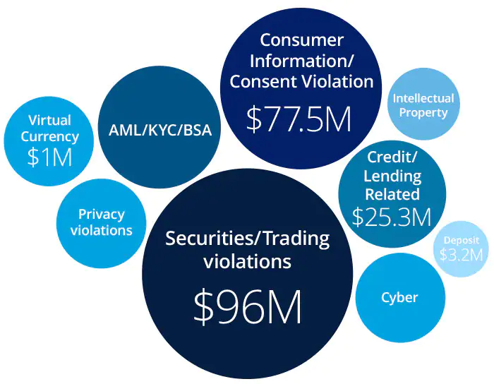

## About

The regulatory environment in the fintech industry refers to the rules and regulations that govern the operations of fintech companies to ensure consumer protection, financial stability, and fair market practices. Government and regulatory bodies create these regulations to prevent fraud, money laundering, and other financial crimes in the fintech sector.

## Key Aspects of Fintech Regulations

- Fintech companies that handle customers' personal and financial data must comply with data protection and privacy regulations to safeguard individuals' information
- Regulatory bodies oversee and regulate fintech activities to maintain market integrity and protect consumers
- Regulations aim to prevent misuse of fintech for illicit activities like money laundering and terrorist financing
- Regulators ensure fintech companies adhere to guidelines related to digital payments, online lending, and securities trading

## Fintech Regulations Globally

- In the UK, the Financial Conduct Authority (FCA) regulates fintech firms to ensure fair treatment of consumers and market integrity
- In the US, the Securities and Exchange Commission (SEC) oversees fintech companies offering securities-related products or services
- The European Union has introduced regulations like PSD2 for open banking and AMLD5 for cryptocurrency exchanges
- Singapore and Australia have created regulatory sandboxes to allow fintech firms to test new products and services

## Fintech Regulations in India

- The Reserve Bank of India (RBI) and the Securities and Exchange Board of India (SEBI) play a crucial role in regulating fintech activities in India
- The RBI has issued guidelines on digital lending, prepaid payment instruments, and credit and debit card issuance
- SEBI has introduced a regulatory sandbox framework to promote innovation in the securities market
- The government has also introduced bills like the Digital Personal Data Protection Bill, 2022 to protect consumer data

The regulatory environment in fintech is constantly evolving to keep pace with technological advancements and emerging risks. Regulators aim to strike a balance between fostering innovation and ensuring financial stability and consumer protection.

References:

1 https://sanctionscanner.com/blog/overview-of-fintech-regulations-in-the-world-143

2 https://iclg.com/practice-areas/fintech-laws-and-regulations/india

3 https://geniusee.com/single-blog/fintech-regulation-legal-and-regulatory-aspects

4 https://www.linkedin.com/pulse/latest-regulatory-changes-fintech-sector-india-bankit-india

5 https://thedocs.worldbank.org/en/doc/954471553198980567-0130022019/original/NFISSession7Fintech.pdf