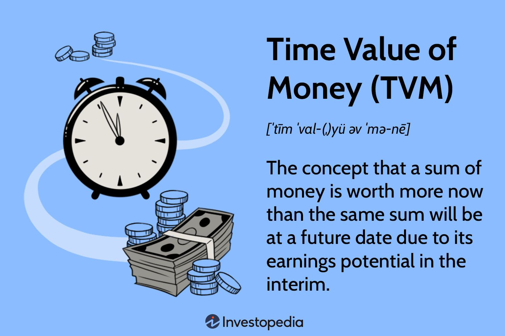
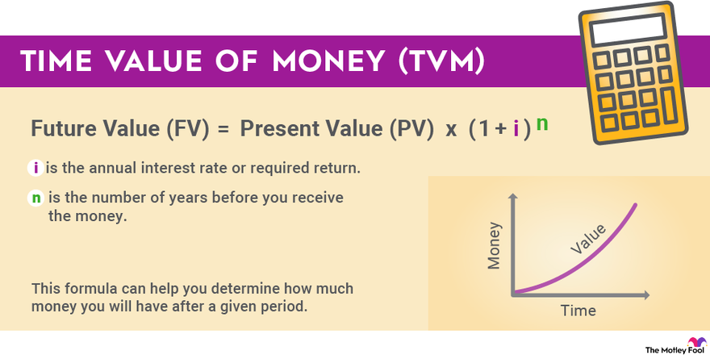

## About
The concept of Time Value of Money (TVM) is fundamental in finance and investment decisions, recognizing that the value of money changes over time due to factors like inflation and the potential to earn interest. It asserts that a dollar received in the future is worth less than a dollar received today. This principle applies not only to currencies like INR, Russian Rubel, and AED but also to any unit of value that can change over time.

### Key Components of Time Value of Money:

- Present Value (PV): The current value of a future sum of money, calculated by discounting it at a certain rate. PV helps determine the worth of future cash flows in today's terms, considering the time value of money.

- Future Value (FV): The value of an investment at a specific future date, accounting for the interest it earns or accumulates over time. FV helps in understanding how an investment grows over a given period.

- Interest Rate (R): The rate at which money grows over time, also known as the discount rate or rate of return. The interest rate plays a crucial role in determining the present and future value of money.

- Time (t): The duration for which money is invested or borrowed. Time is a critical factor in TVM calculations as it influences the growth or decline of the value of money over a specific period.

Understanding these components of TVM is essential for making informed financial decisions, evaluating investment opportunities, and assessing the impact of time on the value of money. By considering PV, FV, interest rate, and time, individuals and businesses can effectively analyze the worth of money at different points in time and make strategic financial choices based on these calculations.

Reference:

1 https://hdfcsky.com/learn/chapters/importance-of-time-value-of-money

2 https://corporatefinanceinstitute.com/resources/valuation/time-value-of-money/

3 https://online.hbs.edu/blog/post/time-value-of-money

4 https://www.investopedia.com/ask/answers/033015/why-time-value-money-tvm-important-concept-investors.asp

5 https://www.investopedia.com/articles/03/082703.aspF