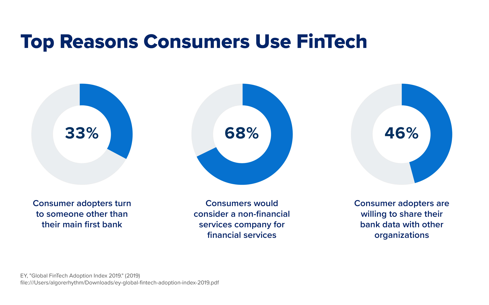
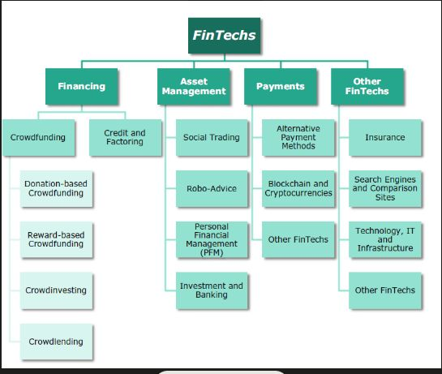

## About

Financial markets are platforms where buyers and sellers trade various financial assets, including stocks, bonds, currencies, and derivatives. These markets facilitate the allocation of capital and the transfer of risk. Some key types of financial markets include:

1. Stock Market: Where shares of publicly traded companies are bought or sold. The stock market allows investors to participate in the growth and success of companies.

2. Bond Markets: Where debt securities issued by governments, corporations, and municipalities are traded. Bonds are debt instruments that represent a loan made by an investor to the bond issuer.

3. Foreign Exchange (Forex) Markets: Where currencies are bought and sold. The forex market is the largest and most liquid financial market in the world, with trillions of dollars traded daily.

4. Commodity Markets: Where raw materials such as gold, oil, and agricultural products are traded. Commodity markets allow producers, consumers, and investors to manage price risk and speculate on the future prices of these goods.

5. Derivatives Markets: Where financial instruments derived from underlying assets are exchanged. Derivatives, such as options and futures contracts, allow market participants to manage risk and speculate on the future prices of the underlying assets.

Financial markets play a crucial role in the global economy by facilitating the flow of capital, enabling price discovery, and providing a platform for risk management. They allow individuals and institutions to invest, raise funds, and manage their financial risks effectively.

References:

1 https://www.nyif.com/fintech-revolution-in-financial-markets.html

2 https://www.bundesbank.de/en/tasks/banking-supervision/individual-aspects/fintech-622840

3 https://www.ntu.ac.uk/course/nottingham-business-school/pg/msc-fintech-and-financial-markets

4 https://www.icmagroup.org/market-practice-and-regulatory-policy/fintech-and-digitalisation/primary-markets-fintech-directory/

5 https://sumsub.com/blog/risk-management-in-fintech-and-how-artificial-intelligence-can-help/