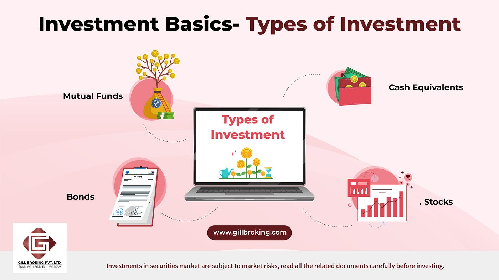
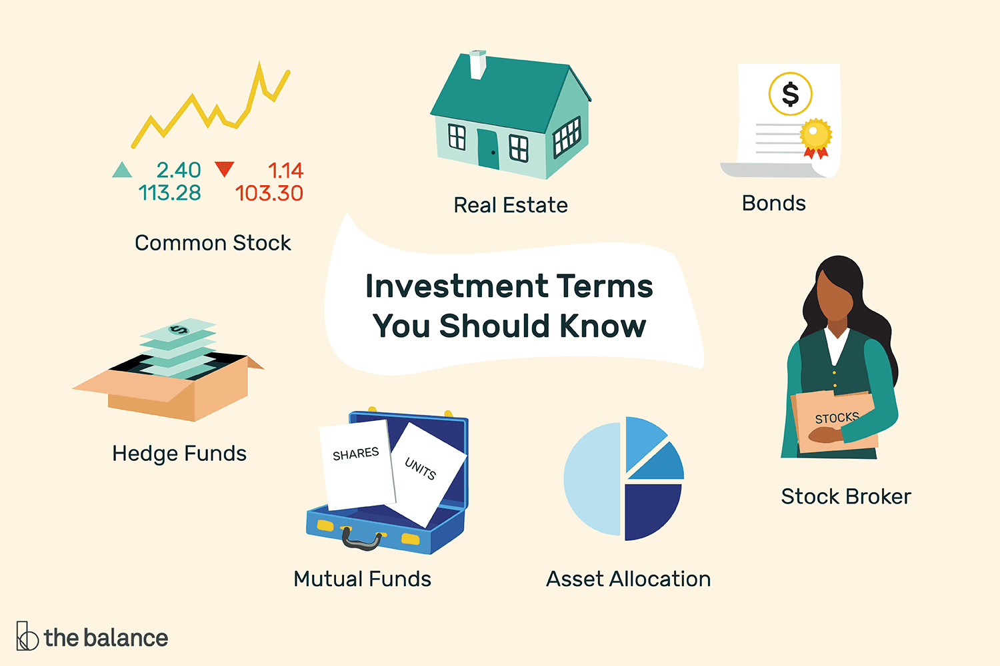

## About

## Investment Basics

Investing involves committing money or capital to an asset with the expectation of generating additional income or profit over time. Key principles of investing include:

1. Diversification: Spreading investments across different assets to reduce risk. Diversification helps investors mitigate the impact of market fluctuations on their overall portfolio by not putting all their eggs in one basket.

2. Risk vs Return: Understanding the trade-off between risk and return. Investors need to assess their risk tolerance and investment goals to find a balance between seeking higher returns and managing the associated risks.

3. Asset Allocation: Allocating investments across asset classes based on investment goals, risk tolerance, and time horizon. Asset allocation is a critical strategy to optimize returns while managing risk effectively.

4. Long-Term Perspective: Investing with a focus on long-term growth and compounding returns. Long-term investing allows investors to benefit from the power of compounding and ride out short-term market fluctuations.

5. Due Diligence: Conducting thorough research and analysis before making investment decisions. Due diligence involves evaluating the fundamentals of an investment, understanding market trends, and assessing potential risks and rewards.

6. Cost Considerations: Evaluating the impact of fees, taxes, and expenses on investment returns. Minimizing costs associated with investing can help enhance overall returns and improve the efficiency of an investment portfolio.

Understanding these fundamental principles of investing is essential for individuals looking to build a successful investment strategy, achieve their financial goals, and navigate the complexities of the financial markets effectively. By applying these principles, investors can make informed decisions, manage risks, and optimize their investment returns over the long term.

References:

1 https://www.finra.org/investors/investing/investing-basics

2 https://fortune.com/recommends/investing/how-to-start-investing/

3 https://icmai.in/upload/PPT_Chapters_RCs/Bilaspur-10102015.pdf

4 https://groww.in/p/investment-basics

5 https://www.investor.gov/introduction-investing