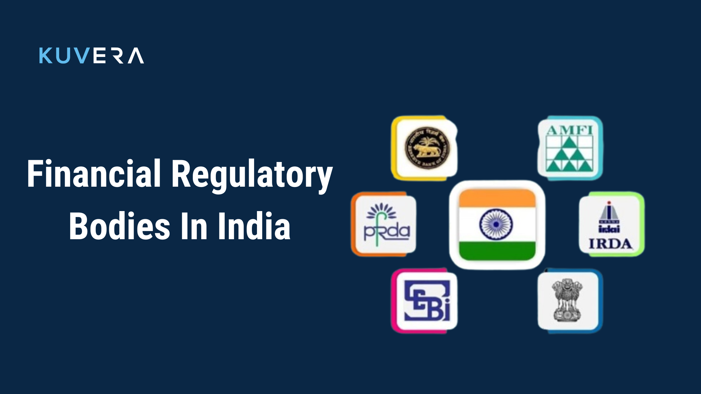

## About

Regulatory bodies in the Indian financial sector play a crucial role in overseeing and regulating various aspects of the industry to ensure stability, integrity, and investor protection. The key regulatory bodies include:

1. Reserve Bank of India (RBI): It is the central bank of India responsible for monetary policy formulation, currency issuance, regulation of banks and financial institutions, and maintenance of financial stability. Its primary functions include:

   - Formulating and executing monetary policy to maintain price stability.
   - Regulating and supervising the banking and financial system to protect depositors' interests and ensure cost-effective banking services.
   - Managing the foreign exchange market and issuing currency.
   - Regulating payment and settlement systems to maintain public confidence.
   - Undertaking developmental activities to support national objectives.

2. Securities and Exchange Board of India (SEBI): It regulates the securities market in India, overseeing stock exchanges, brokers, mutual funds, and other entities. Its objectives include:

   - Protecting the interests of investors and promoting fair and transparent markets.
   - Formulating codes of conduct and guidelines for market participants.
   - Promoting investor education and regulating business in the securities market.
   - Auditing stock market performance and preventing insider trading and unfair trade practices.

3. Insurance Regulatory and Development Authority of India (IRDAI): It regulates the insurance industry in India, overseeing insurance companies, intermediaries, and products. Its primary mandate includes:

   - Issuing certificates of registration and regulating insurance intermediaries.
   - Protecting the interests of policyholders and promoting efficiency in conducting insurance business.
   - Regulating insurance and reinsurance firms to ensure stability and growth.
   - Levying fees and charges for conducting insurance business in compliance with regulations.
   - Resolving disputes, supervising the functioning of the Tariff Advisory Committee, and specifying premium income percentages for insurers.

These regulatory bodies work diligently to maintain the integrity of the financial system, protect investors, and ensure the smooth functioning of the banking, securities, and insurance sectors in India.

References:

1 https://scripbox.com/pf/financial-regulatory-bodies-in-india/

2 https://testbook.com/banking-awareness/financial-regulatory-bodies

3 https://testbook.com/banking-awareness/regulators-of-banks-and-financial-institutions-in-india

4 https://kuvera.in/blog/financial-regulatory-bodies-in-india/

5 https://groww.in/blog/financial-regulatory-bodies-in-india
