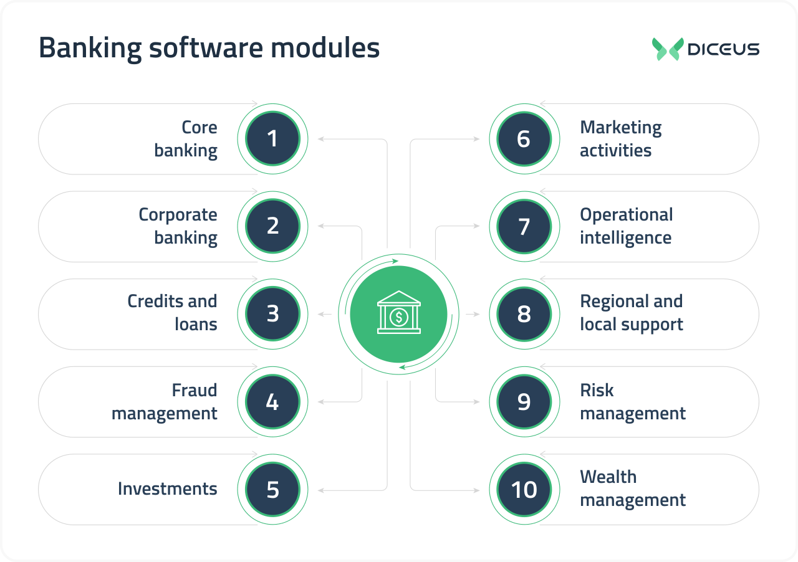
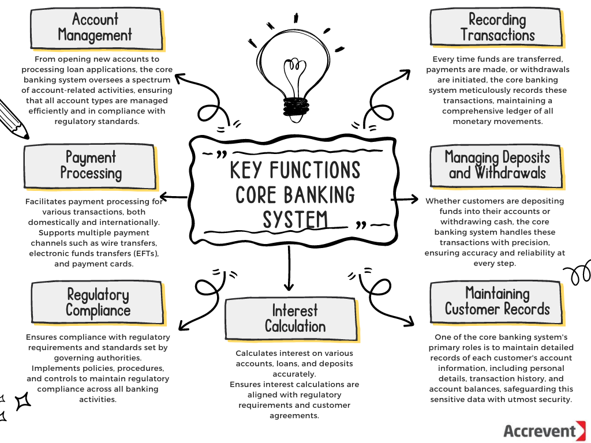
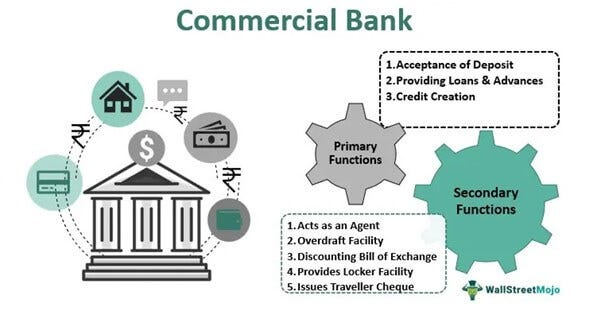

## About

- Banking systems've evolved significantly over time, thus playing a crucial role in facilitating financial transactions, providing credit opportunities and contributing to economic growth. 

- The fundamentals of banking system involves exploring their history, functions, types, regulations and the importance of trust, safety and stability.

- Evolution of Banking systems are described as follows

1. Ancient Times - Banking traces back to ancient civilizations like Mesopotamia and Egypt, where temples served as early banks, storing valuables and providing loans.

2. Medieval Europe - The Renaissance period saw the rise of modern banking with the Medici family in Italy, introducing concepts like bills of exchange and double entry book keeping.

3. Modern Insti(s) - Banking are complex network of institutions these days offering a wide range of financial services to individuals, businesses and governments

- Function of Banks

1. Accepting Deposits - Banks tend to provide a safe place for individuals & businesses to deposit their funds, offering various types of accounts like savings, current and fixed deposits.

2. Providing Loans - Banks play a crucial role in lending money to individuals and businesses for varioous purposes related to economic development.

3. Faciliating payments - Banks enable transactions through services like checking accounts, debit cards and online banking ensuring the smooth flow of funds.

4. Other financial services - Banks offer services like currency exchange, investment products, safe deposit boxes and financial advice.

- Types of Banks

1. Commercial banks - These banks only serve to the general audience/public offering a wide range of services like savings accounts, loans and investments.

2. Central Banks - They are responsible for the money supply's regulation issuing currency and formulating monetary policies to ensure economic stability 

3. Investment Banks - They specialize in complex financial transactions like securities trading, mergers and acquisitions.

4. Cooperative banks - Operate on a cooperative basis, serving specific communities or groups with a focus on mutual benefit.

- Regulation and superision

1. Regulatory bodies - National governments or central banks regulate banks to ensure financial stability, protect consumers and maintain the integrity of the financial system. RBI in india

2. Role of Regulatory bodies : Regulatory bodies like the federal reserve in the US or the european central bank in the eurozone or RBI in India oversee banking opertions, set guidelines and monitor compliance with regulations.

- Importance of Trust and Confidence

1. Stability - Trust is essential for the smooth functioning of banking systems as it ensures depositors' confidence in the safety of the funds.

2. Measures for stability - Regulatory oversight, deposit insurance schemes and risk management practises are crucial for ensuring stability and integration in banking systems.

## Reference links

1. https://study.com/academy/lesson/banking-system-definition-types.html

2. https://byjus.com/govt-exams/functions-of-bank/

3. https://testbook.com/banking-awareness/functions-of-banks

4. https://www.linkedin.com/pulse/understanding-core-banking-systems-bharat-kulkarni-wr4nf/