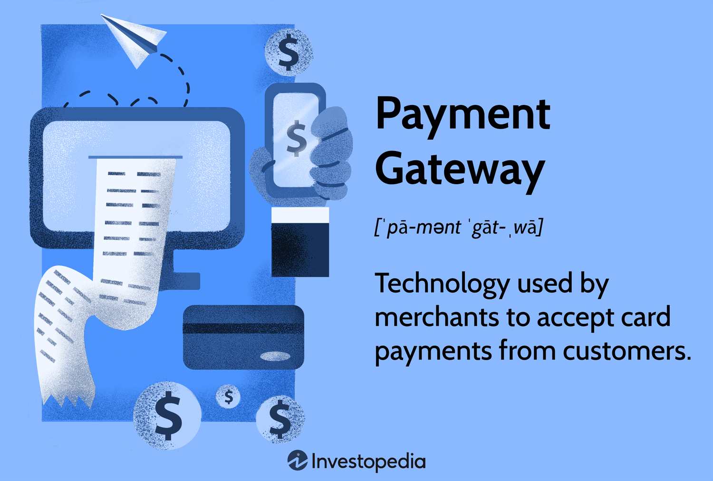
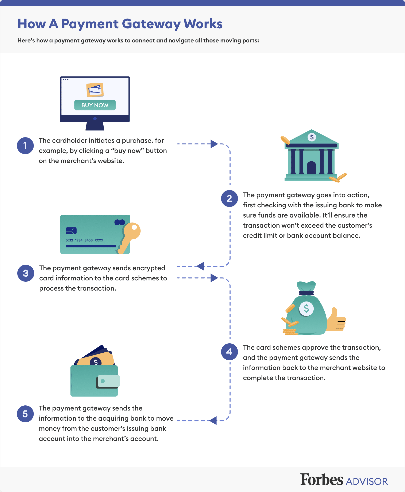
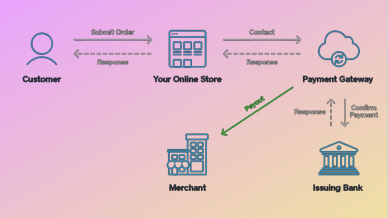
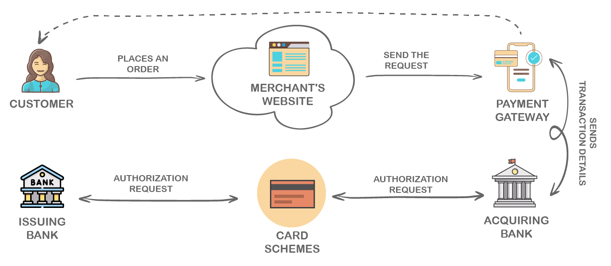

## About

Payment systems and gateways are the backbone of modern financial transactions, enabling the seamless exchange of funds betweeen parties. These systems have evolved significantly, transitioning from traditional cash based transactions to sophisticated electronics and digital payment methods.

- Components of Payment Systems

- Payment Instruments - The tools used to initiate a payment such as cash, checks, credit cards, debit cards, electronics fund transfers(ETFs) and cryptos.

- Payment Channels - The medium through which payments are made, inclding in person, online and mobile platforms.

- Clearing and settlement mechanism - The processses that ensure the accurte and timely exchange of funds between financial institutions.

- Evolution of Payment Systems

1. Traditional cash based transactions - Cash has been the primary means of payment throughout history, but its use has declined with the rise of electronic payment methods.

2. Electronics and Digital payment methods - The intro of credit cards, debit cards and ETFs(Electronic fund transfer) has revolutionized the payment landscape, enabling faster and more convenient transactions.

3. Emerging trends - Contactless payments, peer to peer(P2P) payments and distributed ledger tech(blockchains) are transforming the way we make and recieve payments.

Entities in Payment Systems

1. Issuers - Financial institutions that provide payment instruments to consumers such as credit card issuers and digital wallet providers.

2. Acquirers - Financial instis that process payments on behalf of merchants, enabling them to accept various payment methods.

3. Payment Processors - Intermediaries that faciliate the exchange of information and funds between issuers, acquirers and other parties involved in a payment transaction.

4. Clearing houses- Orgs that ensurer the accurate and timely settlement of funds between financial institutions participating in a payment systems.

> Indian Payment Systems

- UPI(Unified Payments Interface) - A real time payment system developed by the National Payments corporation of India(NPCI) enabling instant fund transfers between bank accounts using a mobile device.

- IMPS(Immediate Payment Service) - An instant real time inter bank electronic funds transfer srvice that allows customers to transfer funds 24/7 through out the year.

- NEFT(National Electronic Funds Transfer) - A nation wide payment system facilitating one to one funds transfer, allowing individuals to electronically transfer funds from any bank branch to any individual having an account with any other bank banch in the country.

- RTGS(Real time gross settlement) - A funds transfer system where the transfer of money takes place from one bank to another on a real time and a gross basis enabling immediate transfer of funds.

> Security and Efficiency in Paymen Systems

- Security measures - Payment systems employ various security measures to protect agains fraud, hacking and system failures such as encryption, authentication protocol and fraud detection algos.

- Efficiency - Modern payment systems are designed to be efficient thereby enabling fast & reliable transactions with minimal delays and errors.

> Emerging Trends and Innovations.

- Contactless Payments - The use of near field communication(NFC) technology to enable secure, touch free payments using credit cards, debit cards or mobile devices.

- Peer to Peer(P2P) Payments - The ability to transfer funds directly between individuals using mobile apps or digital wallets, without the  need for a traditional financial institution.

- Distributed Ledger Technology(DLT) - The use of blockchain tech to create decentralized secure and transparent paymetn systems enabling faster and more efficient transactions.

## References

1. https://stripe.com/resources/more/payment-gateways-101

2.https://www.bigcommerce.com/articles/ecommerce/payment-gateways/

3. https://en.wikipedia.org/wiki/Payment_gateway

4. https://www.investopedia.com/terms/p/payment-gateway.asp