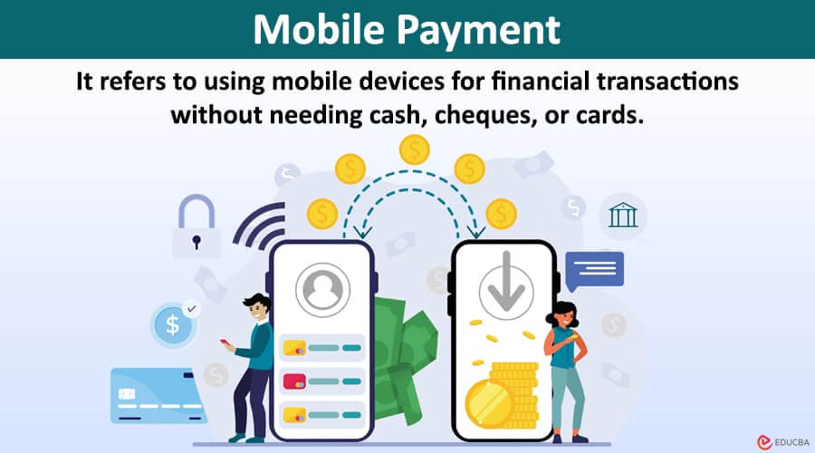
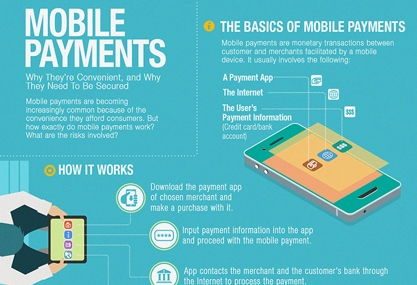

## About

## Mobile Payment Technologies

Mobile payment technologies have revolutionized the way financial transactions are conducted, offering convenience, speed, and security to users worldwide. These technologies leverage mobile devices like smartphones and tablets to enable digital payments, providing advantages over traditional methods like cash and physical cards

### Types of Mobile Payment Technologies

- Mobile Wallets: Apps like Google Pay, Apple Pay, and Paytm that securely store payment information for contactless transactions. They allow users to make in-store, online, and peer-to-peer payments using various methods like NFC, QR codes, and biometric authentication.

- Mobile Banking Apps: Offered by financial institutions like SBI and ICICI Bank, enabling fund transfers, bill payments, and other banking services directly from mobile devices.

- Near Field Communication (NFC): Enables contactless payments by tapping the device on compatible terminals. NFC payments are fast, secure, and convenient for in-store transactions.

- QR Code Payments: Allow transactions by scanning QR codes, offering a convenient and secure payment method. Apps like PhonePe and BHIM UPI support QR code payments in India.

### Adoption and Acceptance Worldwide

- Factors Driving Growth: Increasing smartphone penetration, convenience, speed, and security are key drivers of mobile payment adoption globally.

- Barriers to Adoption: Interoperability issues between different platforms, security concerns, lack of merchant acceptance, and regulatory challenges hinder widespread adoption.

### Security and Privacy Considerations

- Data Encryption: Mobile payment platforms use advanced encryption techniques to secure payment information during transmission.

- Biometric Authentication: Fingerprint or facial recognition ensures secure user authentication, reducing the risk of unauthorized access.

- Regulatory Compliance: Mobile payment providers adhere to data protection regulations to safeguard user privacy and financial information.

### Future Trends and Developments

- Integration of AI: Artificial intelligence will enhance personalized payment experiences and fraud detection2.

- Internet of Things (IoT): IoT devices will enable seamless and secure transactions, expanding the scope of mobile payments.

- Wearable Devices: Smartwatches and other wearables will become popular payment tools, offering convenience and accessibility to users.

## References:

1 https://razorpay.com/learn/mobile-payment/

2 https://www.nttdatapay.com/blog/mobile-payment-systems/

3 https://www.slideshare.net/slideshow/top-mobile-payment-apps-in-india-2017/79319672

4 https://www.investopedia.com/terms/m/mobile-payment.asp

5 https://www.bluecart.com/blog/mobile-payments