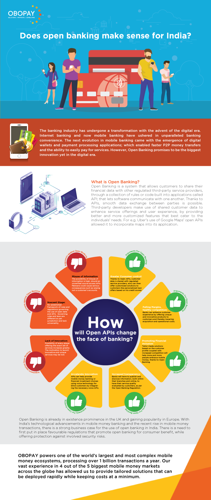
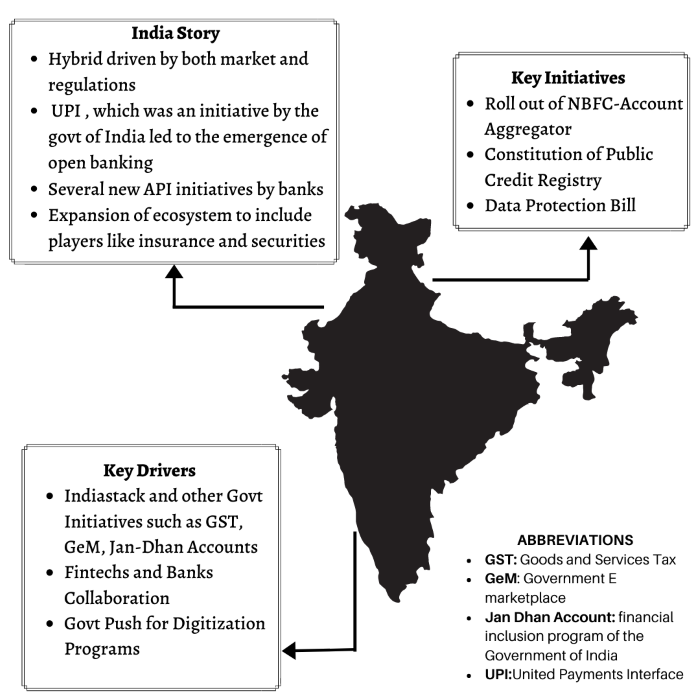

## About

## Open Banking Initiatives

Open banking is a financial services model that promotes the sharing of customer data and interoperability between financial institutions through the use of APIs. This concept has gained significant traction in India, driven by regulatory mandates, technological advancements, and changing consumer expectations.

### Definition and Key Principles

- Open Banking: A framework that allows third-party providers to access customer data and build applications and services on top of a bank's infrastructure.

- Key Principles: Data sharing, interoperability, and the use of APIs to facilitate secure and efficient financial services.

### Drivers of Open Banking Adoption

- Regulatory Mandates: The Reserve Bank of India (RBI) has introduced initiatives like the Account Aggregator framework to promote open banking and financial inclusion.

- Technological Advancements: The development of India Stack, which includes Aadhaar for identity verification and UPI for financial transactions, has laid the foundation for open banking.

- Changing Consumer Expectations: Indian consumers, particularly millennials and Gen Z, are increasingly seeking personalized, convenient, and accessible financial services.

### Benefits of Open Banking
- Increased Competition: Open banking enables new entrants like fintech startups to compete with traditional banks, driving innovation and better services.

- Better Access to Financial Products: Consumers can access a wider range of financial products and services tailored to their needs.

- Personalized Experiences: Open banking allows for the creation of personalized financial solutions based on customer data and preferences.

### Challenges and Risks
- Data Privacy Concerns: Ensuring the secure storage and sharing of customer data is crucial to maintain trust and comply with regulations.

- Security Vulnerabilities: Open banking APIs must be designed with robust security measures to prevent unauthorized access and data breaches.
- Regulatory Compliance: Financial institutions must adhere to evolving regulations and guidelines set by the RBI and other regulatory bodies.

### Role of Fintech Companies and Third-Party Developers

- Driving Innovation: Fintech companies and third-party developers leverage open banking APIs to create innovative financial solutions and services.

- Collaboration with Banks: Fintech firms often collaborate with traditional banks to offer their services, leveraging the banks' customer base and infrastructure.

### Impact on Stakeholders
- Traditional Banks: Banks must adapt to the open banking ecosystem by embracing APIs, collaborating with fintech firms, and offering personalized services to remain competitive.

- Fintech Startups: Open banking provides a level playing field for fintech startups to compete with established players, fostering innovation and growth.

- Consumers: Open banking empowers consumers by giving them greater control over their financial data and access to a wider range of financial services.

## References:
1 https://blog.quickwork.co/open-banking-apis-enabling-fintech-collaboration-in-the-indian-market/

2 https://kinaracapital.com/indias-approach-to-the-open-banking-api-ecosystem/

3 https://www.investindia.gov.in/team-india-blogs/age-digital-banking-role-apis-proliferating-financial-services

4 https://news.abplive.com/business/open-banking-what-is-it-timeline-india-npci-upi-aadhaar-1549331

5 https://www.openbankingtracker.com/country/india

6 https://www.linkedin.com/pulse/unravelling-indias-approach-open-banking-elora-sahooqrylc/

