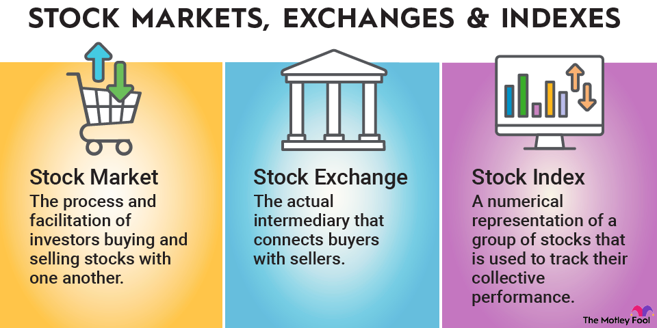
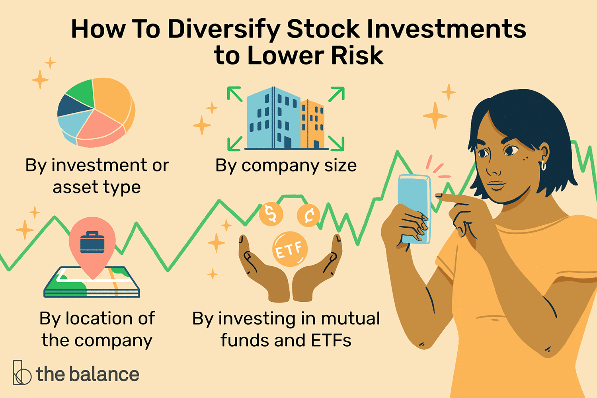

## About

Stock markets play a pivotal role in the global economy, serving as platforms where stocks, representing ownership in publicly traded companies, are bought and sold. These markets are essential for raising capital, facilitating investment, and driving economic growth. Understanding stock markets involves grasping key concepts like stock indices, market capitalization, and the price-earnings ratio (P/E ratio), which provide insights into market performance and valuation metrics.

### Introduction to Stock Markets

- Global Economic Significance: Stock markets are vital components of the financial system, enabling companies to raise capital by issuing shares to investors.

- Ownership Representation: Stocks represent ownership in companies, entitling shareholders to a portion of the company's profits and voting rights in corporate decisions.

- Stock Exchanges: Platforms where stocks are traded, connecting buyers and sellers to facilitate transactions and determine stock prices.

### Key Concepts in Stock Markets

- Stock Indices: Benchmarks that track the performance of a group of stocks, providing insights into market trends and investor sentiment.

- Market Capitalization: The total value of a company's outstanding shares, calculated by multiplying the share price by the number of shares outstanding.

- Price-Earnings Ratio (P/E Ratio): A valuation metric that compares a company's stock price to its earnings per share, indicating how much investors are willing to pay for each dollar of earnings.

### Investment Strategies in Stock Markets

- Value Investing: Focuses on buying undervalued stocks with the potential for long-term growth, based on fundamental analysis of a company's financial health.

- Growth Investing: Involves investing in companies with strong growth potential, even if their current stock prices may seem high relative to earnings.

- Dividend Investing: Emphasizes investing in companies that pay regular dividends, providing a steady income stream to investors.

### Factors Influencing Stock Prices
- Company Performance: Earnings reports, revenue growth, and profitability directly impact stock prices, reflecting the company's financial health.

- Economic Indicators: Factors like GDP growth, interest rates, and inflation influence market sentiment and investor confidence.

- Market Sentiment: Investor perceptions, news events, and geopolitical factors can drive stock prices up or down based on market sentiment.

### Risks and Rewards of Stock Market Investing

- Volatility: Stock prices can fluctuate significantly in response to market conditions, economic events, and company-specific news.

- Long-Term Growth Potential: Investing in stocks offers the potential for long-term capital appreciation and wealth accumulation over time.

Investing in stocks involves a balance of risk and reward, requiring investors to conduct thorough research, diversify their portfolios, and adopt investment strategies aligned with their financial goals and risk tolerance. By understanding the dynamics of stock markets and the factors influencing stock prices, investors can make informed decisions to navigate the complexities of the financial markets effectively.

The National Stock Exchange of India (NSE) and the Bombay Stock Exchange (BSE) are key players in the Indian stock market, facilitating the trading of stocks and other financial instruments. NSE, based in Mumbai, is one of the leading stock exchanges in India, boasting a significant market capitalization and a wide range of listed companies. 

On the other hand, BSE, formerly known as the Bombay Stock Exchange, is Asia's premier stock exchange, offering live updates on stock market performance and serving as a vital platform for investors in India and beyond.

### National Stock Exchange of India (NSE)

- Location: Mumbai, Maharashtra, India

- Ownership: Owned by various financial institutions, banks, insurance companies, and public and private entities

- Market Cap: ₹334.7 trillion (US$4.2 trillion) as of December 2023

- Key Index: NIFTY 50, a benchmark index widely used by investors in India and globally

- Derivatives Trading: NSE is the world's largest derivatives exchange by the number of contracts traded, offering a robust platform for derivative instruments

### Bombay Stock Exchange (BSE)

- Location: Mumbai, Maharashtra, India

- History: Formerly known as the Bombay Stock Exchange, BSE is a prominent stock exchange in India with a rich legacy and a strong presence in the financial market

- Market Updates: BSE provides live updates on stock market performance, including indices like Sensex and market trends

- Investor Support: Offers various services for investors, including complaint filing, investor support, and reporting suspicious activities

- Global Investors: Attracts investments from global entities like Gagil FDI Limited, GS Strategic Investments Limited, and other international stakeholders

Both NSE and BSE play crucial roles in the Indian stock market ecosystem, providing investors with opportunities to trade stocks, derivatives, and other financial instruments. These exchanges serve as pillars of the Indian financial system, contributing to capital formation, investment growth, and market transparency. 

Investors rely on NSE and BSE for market insights, trading opportunities, and a platform to participate in India's dynamic and evolving financial landscape.

References:

1 https://www.investopedia.com/terms/s/stockmarket.asp

2 https://www.nerdwallet.com/article/investing/how-to-invest-in-stocks

3 https://www.hdfcbank.com/personal/resources/learning-centre/invest/how-to-invest-in-share-market

4 https://groww.in/blog/how-to-invest-in-share-market

5 https://groww.in/stocks

6 https://www.bseindia.com

7 https://en.wikipedia.org/wiki/National_Stock_Exchange_of_India

8 https://www.nseindia.com/market-data/live-equity-market

9 https://www.nseindia.com

10 https://www.moneycontrol.com
