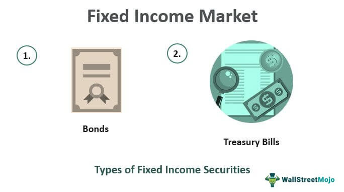

## About

Bond markets are essential financial platforms where debt securities issued by governments, municipalities, and corporations are bought and sold. 

These markets play a crucial role in the global economy, providing investors with opportunities to invest in fixed income instruments that offer steady returns and diversification benefits.

### How Bonds Work

- Structure: Bonds are debt instruments where the issuer borrows funds from investors and promises to repay the borrowed amount, along with periodic interest payments, over a specified period.

- Maturity: Bonds have a fixed maturity date when the principal is repaid to the investor, distinguishing them from stocks that have perpetual existence until sold.

- Coupon Rate: The interest rate paid by the bond issuer to the bondholder, typically distributed semiannually as coupon payments.

- Yield: The return on investment generated by a bond, calculated as the coupon payments divided by the bond's price.

### Types of Bonds

- Government Bonds: Issued by national governments, considered low-risk investments backed by the government's credit, offering relatively low returns but high security.

- Corporate Bonds: Issued by companies to raise capital, providing higher yields but with varying levels of risk based on the issuer's creditworthiness.

- Municipal Bonds: Issued by local governments to fund public projects, often offering tax advantages to investors.

- High-Yield Bonds: Also known as junk bonds, these bonds offer higher returns but come with higher risk due to the lower credit ratings of the issuers.

### Bond Prices and Interest Rates

- Bond Yield Curve: The relationship between bond prices and interest rates, where changes in interest rates impact bond prices inversely.

- Interest Rate Risk: Bonds are sensitive to changes in interest rates, with bond prices moving in the opposite direction to interest rate changes.

### Role of Bonds in Investment Portfolios

- Income Generation: Bonds provide a steady income stream through interest payments, making them suitable for investors seeking stability and predictable returns.

- Risk Mitigation: Bonds can help diversify investment portfolios, balancing the risk exposure of stocks and providing a hedge against market volatility.

### Risks Associated with Bonds

- Credit Risk: The risk of the bond issuer defaulting on interest payments or failing to repay the principal amount.

- Inflation Risk: The risk that inflation erodes the purchasing power of bond returns over time, reducing the real value of income generated by bonds.

Investing in bonds requires a thorough understanding of the different types of bonds, their risks, and their role in a diversified investment strategy. By carefully assessing the risks and rewards associated with bond investments, investors can build resilient portfolios that balance income generation with risk management in the dynamic financial markets.

## References:

1 https://www.investopedia.com/terms/b/bondmarket.asp

2 https://www.nyif.com/fixed-income-instruments-and-markets.html

3 https://www.investopedia.com/terms/f/fixed-incomesecurity.asp

4 https://www.nism.ac.in/2023/11/understanding-bonds-and-bond-market/

5 https://groww.in/p/fixed-income-securities