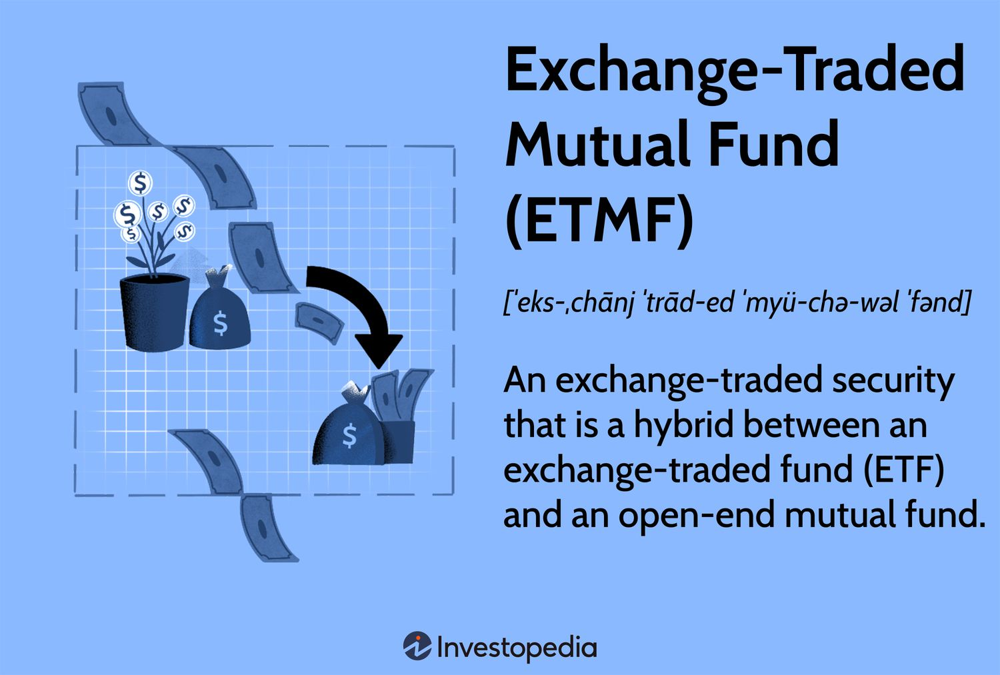
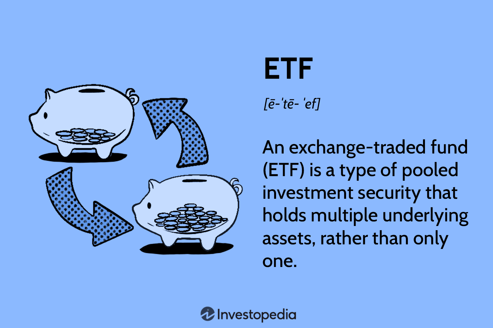
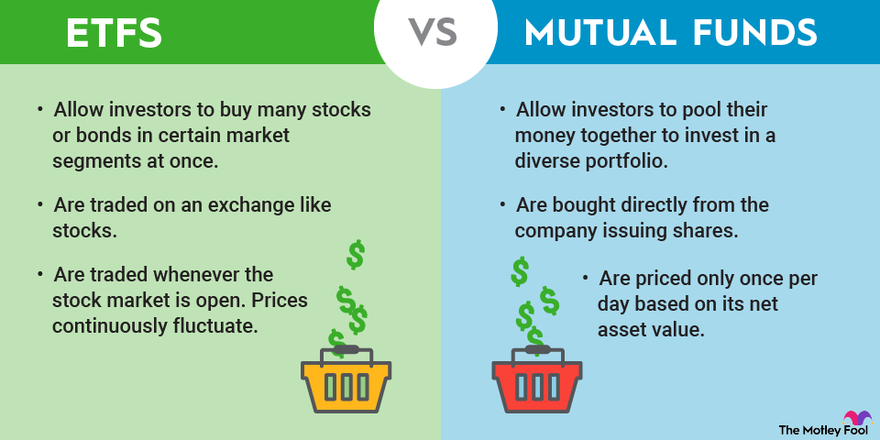
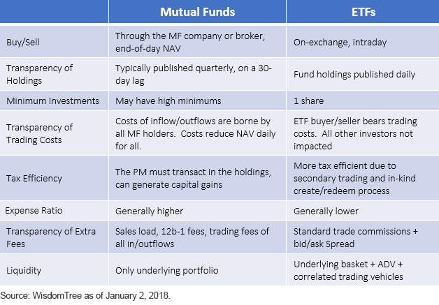

## About

Mutual funds and exchange-traded funds (ETFs) are both investment vehicles that pool money from multiple investors to invest in a diversified portfolio of securities. While they share some similarities, there are also key differences in their structure, liquidity, fees, and tax implications.

### Mutual Funds

- Structure: Mutual funds are actively managed by professional fund managers who select the securities to be included in the fund's portfolio.

- Liquidity: Mutual fund shares are bought and sold directly with the fund company, and their prices are determined at the end of each trading day based on the fund's net asset value (NAV).

- Fees: Mutual funds typically have higher expense ratios compared to ETFs, as they incur additional costs for active management and marketing.

- Tax Implications: Mutual funds are less tax-efficient than ETFs, as they may generate capital gains distributions when the fund manager sells securities.

### Exchange-Traded Funds (ETFs)

- Structure: ETFs are passively managed funds that track a specific index, sector, or asset class.

- Liquidity: ETF shares are traded on stock exchanges throughout the trading day, similar to individual stocks.

- Fees: ETFs generally have lower expense ratios compared to actively managed mutual funds, as they do not require active management.

- Tax Implications: ETFs are more tax-efficient than mutual funds, as they use an in-kind redemption process that minimizes capital gains distributions.

### Benefits of Investing in Mutual Funds and ETFs

- Diversification: Both mutual funds and ETFs provide investors with exposure to a diversified portfolio of securities, reducing overall risk.

- Professional Management: Mutual funds offer the expertise of professional fund managers who actively select and monitor the fund's investments.

- Accessibility: Mutual funds and ETFs allow investors to access a wide range of asset classes, sectors, and investment strategies.

### Types of Mutual Funds and ETFs

- Equity Funds: Invest primarily in stocks, offering exposure to various sectors, market capitalizations, or investment styles.

- Bond Funds: Invest in fixed-income securities like government bonds, corporate bonds, or municipal bonds.

- Index Funds: Passively track a specific market index, such as the S&P 500 or the NASDAQ Composite.

- Sector Funds: Focus on a particular industry or sector, such as technology, healthcare, or energy.

### Buying and Selling Mutual Funds and ETFs

- Mutual Funds: Investors purchase and redeem shares directly from the fund company, and the fund manager is responsible for managing the portfolio.

- ETFs: Investors buy and sell ETF shares on stock exchanges through brokers, and market makers ensure the efficient functioning of the ETF market.

### Performance Evaluation

- Expense Ratio: The annual fees charged by the fund, expressed as a percentage of the fund's assets.

- Net Asset Value (NAV): The per-share value of the fund's assets, calculated by dividing the total value of the fund's holdings by the number of outstanding shares.

- Total Return: The overall performance of the fund, including capital appreciation and reinvested dividends or interest payments.

Both mutual funds and ETFs offer investors the opportunity to participate in the financial markets with a diversified portfolio. The choice between the two depends on the investor's investment objectives, risk tolerance, and preferences regarding active management, liquidity, and tax efficiency.

References:

1 https://groww.in/p/exchange-traded-funds

2 https://www.investopedia.com/terms/e/etf.asp

3 https://www.bajajfinserv.in/exchange-traded-fund

4 https://www.amfiindia.com/investor-corner/knowledge-center/etf.html

5 https://investor.vanguard.com/investor-resources-education/etfs/etf-vs-mutual-fund