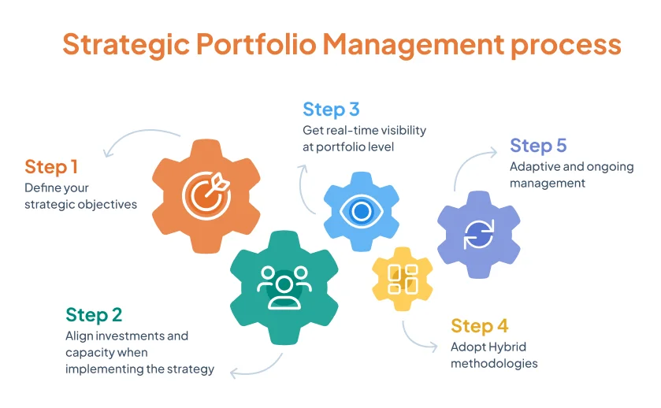
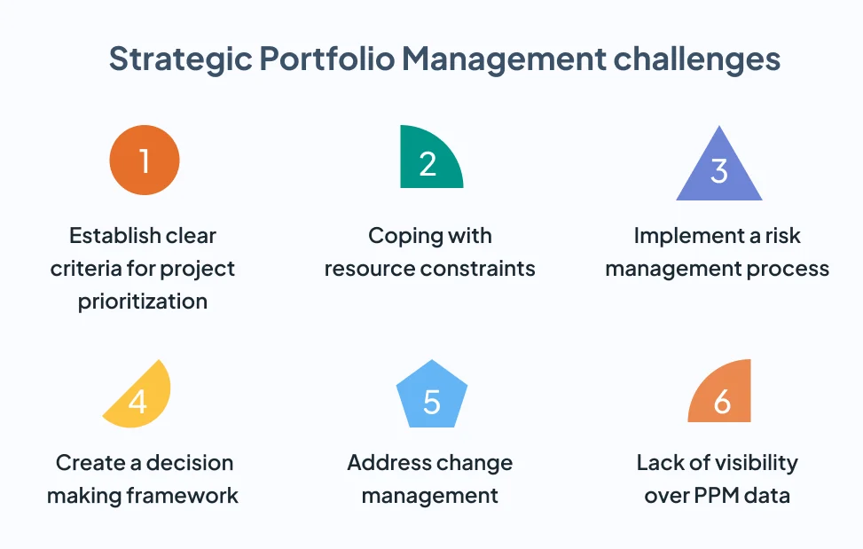
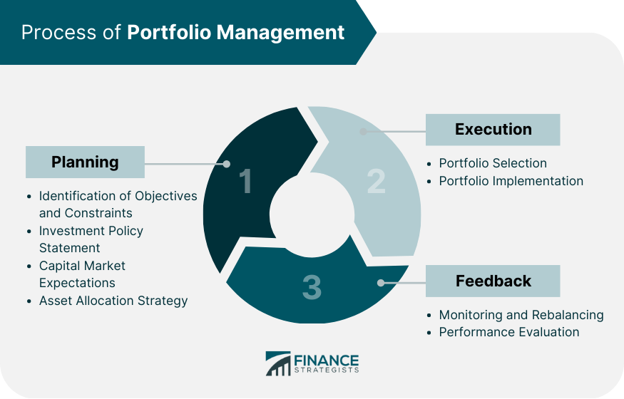

## About

Portfolio management is a strategic process that involves allocating assets to achieve investment objectives while effectively managing risk. This discipline plays a crucial role in optimizing returns, preserving capital, and achieving financial goals through a well-structured investment approach.

### Importance of Portfolio Management

- Asset Allocation: The strategic distribution of investments across different asset classes to achieve a balance between risk and return.

- Diversification: Spreading investments across various asset classes, industries, and regions to reduce overall portfolio risk.

- Rebalancing: Periodically adjusting the portfolio to maintain the desired asset allocation and risk profile, ensuring alignment with investment goals.

### Portfolio Management Strategies

- Passive Investing: A strategy that aims to replicate the performance of a specific market index or benchmark, minimizing costs and emphasizing long-term growth.

- Active Investing: Involves actively selecting and managing investments to outperform the market, relying on research, analysis, and market timing.

- Tactical Asset Allocation: Adjusting the portfolio based on short-term market conditions or economic outlook to capitalize on opportunities and manage risks.

### Theoretical Frameworks

- Modern Portfolio Theory (MPT): A framework that emphasizes diversification to optimize returns for a given level of risk, highlighting the benefits of combining assets with different risk-return profiles.

- Capital Asset Pricing Model (CAPM): A model that calculates the expected return on an asset based on its risk relative to the market, helping investors assess the appropriate risk-adjusted return for an investment.

### Alternative Investment Strategies

- Value Investing: Focuses on buying undervalued securities with the potential for long-term growth, based on fundamental analysis of intrinsic value.

- Growth Investing: Seeks companies with strong growth potential, even if their current stock prices may seem high relative to earnings, emphasizing future growth prospects.

- Momentum Investing: Capitalizes on the trend-following strategy, investing in assets that have shown positive price momentum in the past.

- Factor Investing: Focuses on specific factors like value, size, momentum, or quality to drive investment returns, aiming to capture specific risk premia in the market.

### Technology in Portfolio Management

- Robo-Advisors: Automated platforms that provide algorithm-based portfolio management and investment advice, offering cost-effective and efficient solutions for investors.

- Algorithmic Trading Strategies: Utilize data analytics, machine learning, and quantitative models to make investment decisions, execute trades, and manage portfolios efficiently.

By incorporating sound portfolio management strategies, investors can optimize their investment portfolios, achieve diversification, and align their investments with their financial goals and risk tolerance. 

The use of theoretical frameworks, alternative investment strategies, and technology-driven solutions enhances the effectiveness and efficiency of modern portfolio management practices, empowering investors to make informed decisions and navigate the complexities of the financial markets successfully.

## References

1. https://www.tcgen.com/product-portfolio-management/