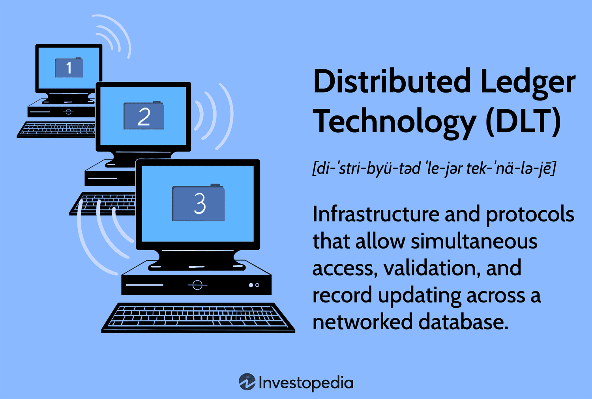
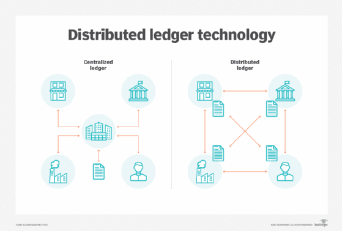
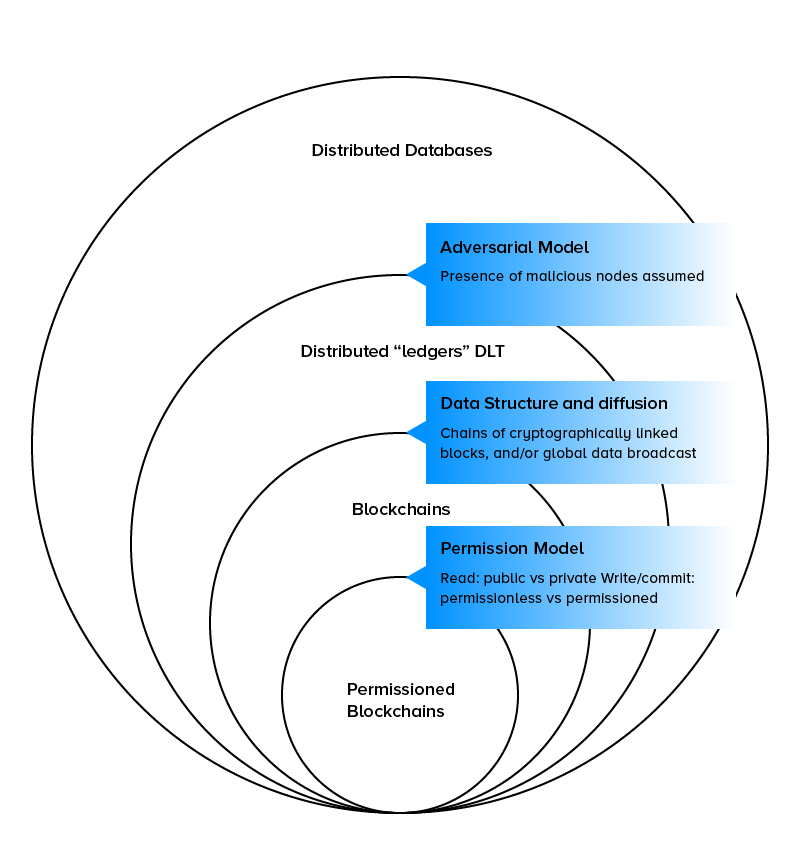
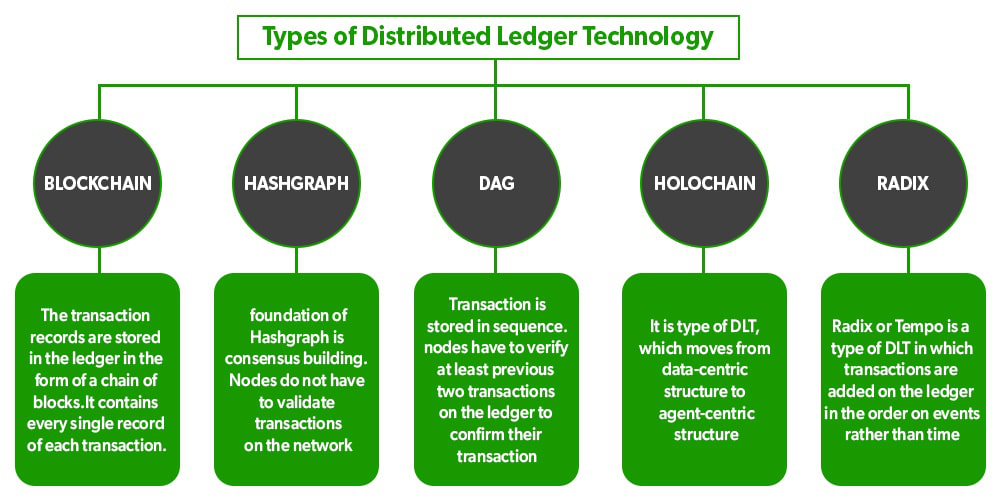

## About

Blockchain technology serves as a distributed ledger technology (DLT) that enables secure and transparent recording of transactions across multiple nodes in a decentralized network. This innovative technology has revolutionized various industries by providing a tamper-resistant and efficient way to record and verify transactions.

### Key Concepts of Blockchain and DLT

- Blocks: Data structures that contain transaction information and are linked together to form a chain, ensuring the integrity and security of the data.

- Transactions: Records of data exchanges between participants in the network, stored within blocks to create an immutable transaction history.

- Cryptographic Hash Functions: Algorithms that convert data into a fixed-size string of characters, ensuring data integrity and security.

- Consensus Mechanisms: Protocols like proof of work and proof of stake that validate transactions and secure the network by achieving agreement among participants.

### Features of Blockchain Technology

- Immutability: Each block in the blockchain is cryptographically linked to the previous block, creating a chain that cannot be altered without detection, ensuring data integrity.

- Transparency: All transactions recorded on the blockchain are visible to network participants, promoting trust and accountability in the system.

### Types of Blockchain Networks
- Public Blockchains: Open networks like Bitcoin and Ethereum where anyone can participate, view transactions, and contribute to the network's security.

- Private Blockchains: Permissioned networks with restricted access, suitable for organizations requiring control over network participants and data privacy.

- Consortium Blockchains: Semi-decentralized networks where a group of organizations collaborates to maintain the blockchain, ideal for industries requiring shared data management.

### Real-World Applications of Blockchain

- Supply Chain Management: Tracking products from manufacturer to consumer, ensuring transparency and authenticity in the supply chain.

- Voting Systems: Enhancing the security and integrity of voting processes, reducing fraud and ensuring accurate election results.

- Identity Verification: Providing secure and decentralized identity management solutions, enabling individuals to control and share their personal information securely.

- Decentralized Finance (DeFi): Revolutionizing traditional financial services by offering decentralized lending, borrowing, and trading platforms, eliminating the need for intermediaries.

Blockchain technology has transcended its origins in cryptocurrencies to become a transformative force in various sectors, offering secure, transparent, and efficient solutions for data management, transaction processing, and decentralized applications. 

By leveraging the unique features of blockchain and DLT, organizations can enhance trust, streamline operations, and unlock new possibilities for innovation and collaboration in the digital age.

## References:

1 https://documents1.worldbank.org/curated/en/177911513714062215/pdf/122140-WP-PUBLIC-Distributed-Ledger-Technology-and-Blockchain-Fintech-Notes.pdf

2 https://www.futurelearn.com/courses/demystifying-blockchain

3 https://coinmarketcap.com/academy/article/what-is-distributed-ledger-technology-dlt

4 https://appinventiv.com/blog/blockchain-vs-dlt-guide/

5 https://dltledgers.com/blog/blockchain-for-dummies-an-essential-guide-explaining-the-basics-of-enterprise-blockchain/