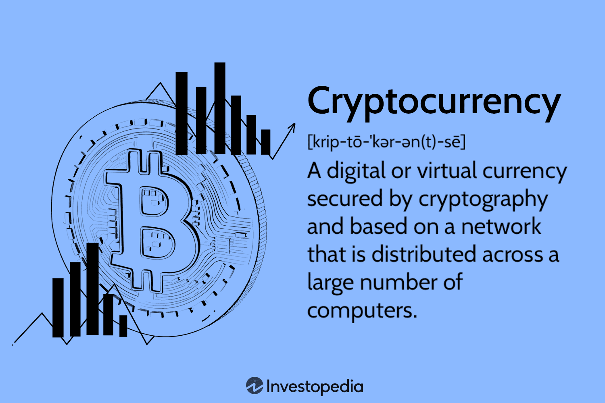
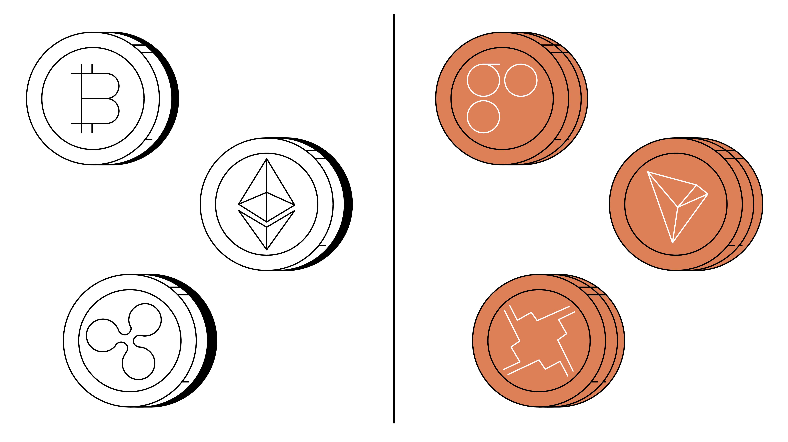
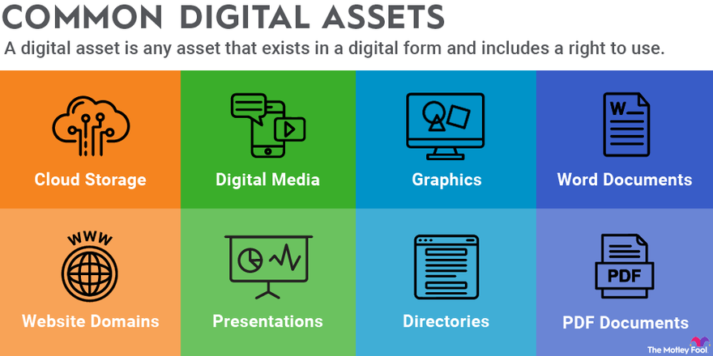

## About

Cryptocurrencies are digital or virtual currencies that utilize cryptographic techniques for secure financial transactions and operate on decentralized networks. 

These digital assets have gained significant attention for their potential to revolutionize the financial landscape and offer innovative solutions for various use cases.

### Introduction to Cryptocurrencies

- Cryptocurrencies are digital currencies secured by cryptography, enabling secure peer-to-peer transactions without the need for intermediaries.

- Bitcoin, introduced in 2009, was the first cryptocurrency, paving the way for the development of alternative cryptocurrencies (altcoins) and tokenized assets.
  

### Mechanisms of Cryptocurrency Transactions

- Public and Private Keys: Public keys are used to receive funds, while private keys are required to authorize transactions, ensuring security and ownership.

- Wallets: Digital wallets store public and private keys, allowing users to manage their cryptocurrency holdings and conduct transactions.

- Addresses: Cryptocurrency addresses are alphanumeric strings used to send and receive digital assets on the blockchain.

- Blockchain Confirmations: Transactions are validated and added to the blockchain through a consensus mechanism, ensuring transparency and immutability.

### Role of Cryptocurrencies in the Global Economy

- Cryptocurrencies serve as a medium of exchange, enabling borderless and efficient transactions across the globe.

- They also function as a store of value, offering an alternative to traditional fiat currencies and serving as a hedge against inflation.

- Cryptocurrencies have emerged as investment assets, attracting investors seeking diversification and potential high returns in a volatile market.

### Regulatory Challenges and Considerations

- Regulatory bodies worldwide are grappling with issues related to security, fraud, money laundering, and tax compliance in the cryptocurrency space.

- Concerns about investor protection, market manipulation, and the illicit use of cryptocurrencies have prompted regulatory scrutiny and evolving frameworks.

### Emerging Trends in the Cryptocurrency Space

- Stablecoins: Cryptocurrencies pegged to stable assets like fiat currencies or commodities, offering price stability and facilitating seamless transactions.

- Non-Fungible Tokens (NFTs): Unique digital assets representing ownership of digital art, collectibles, and other unique items, leveraging blockchain technology for provenance and authenticity.

- Central Bank Digital Currencies (CBDCs): Digital versions of fiat currencies issued by central banks, exploring the potential benefits of blockchain technology for enhancing payment systems and financial inclusion.

Cryptocurrencies and digital assets continue to evolve, presenting new opportunities and challenges in the financial landscape. As the industry matures, regulatory frameworks, technological innovations, and market dynamics will shape the future of cryptocurrencies, influencing their adoption, utility, and impact on the global economy.

## References

1. https://www.gemini.com/cryptopedia/cryptocurrencies-vs-tokens-difference

2. https://www.investopedia.com/terms/d/digital-currency.asp