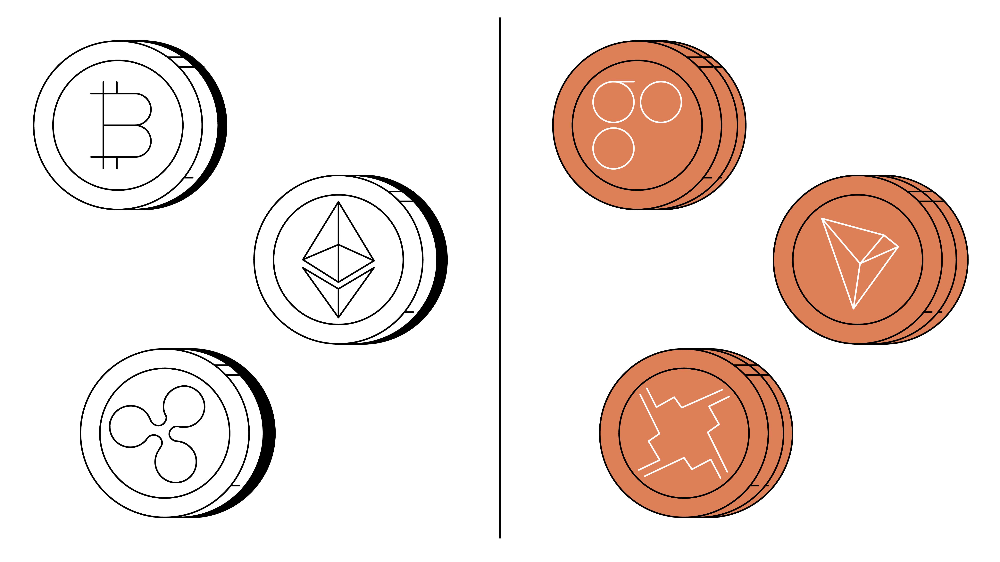

## About

Smart contracts are self-executing contracts with the terms of the agreement directly written into code and deployed on a blockchain platform. These contracts automate the execution of specific actions based on predetermined conditions, ensuring transparency, security, and the elimination of intermediaries. 

The advantages of smart contracts include automation, transparency, security, and the elimination of intermediaries, which enhance trust and efficiency in transactions.

### Blockchain Platforms Supporting Smart Contracts

Several blockchain platforms support smart contract functionality, including Ethereum, EOS, and Cardano. Each platform has distinct features and capabilities that cater to different use cases and requirements. 

For instance, Ethereum is known for its versatility and has been used extensively in decentralized finance (DeFi) applications, while EOS is designed for scalability and supports multiple programming languages. Cardano, on the other hand, focuses on a more secure and scalable architecture.

### Real-World Applications of Smart Contracts

Smart contracts have been applied in various real-world scenarios, such as:

1. Decentralized Finance (DeFi): Smart contracts enable lending, borrowing, and yield farming in decentralized financial systems, offering alternatives to traditional financial institutions.

2. Supply Chain Management: Smart contracts can automate inventory tracking, shipping, and payment processes, enhancing transparency and efficiency in supply chain operations.

3. Digital Identity: Smart contracts can be used to manage digital identities, ensuring secure and decentralized management of personal data.

4. Tokenization of Assets: Smart contracts can facilitate the creation and management of digital tokens representing ownership of assets, such as real estate or art.

### Decentralized Applications (DApps)

Decentralized applications (DApps) are applications built on blockchain technology that operate without a central authority or single point of failure. DApps are designed to provide users with control over their data and transactions, ensuring transparency and security. They can be used for a wide range of applications, from finance to gaming and social networking.

### Challenges and Limitations

While smart contracts and DApps offer significant benefits, they also face challenges and limitations, including:

1. Scalability Issues: Smart contracts and DApps can struggle with scalability, particularly when dealing with large volumes of transactions.

2. Security Vulnerabilities: Smart contracts and DApps are susceptible to security vulnerabilities, such as hacking and bugs, which can compromise their integrity.

3. Regulatory Uncertainties: The regulatory landscape for smart contracts and DApps is still evolving, leading to uncertainties and potential legal challenges.

## References:

1 https://www.investopedia.com/terms/d/digital-currency.asp

2 https://www.gemini.com/cryptopedia/cryptocurrencies-vs-tokens-difference

3 https://www.linkedin.com/pulse/smart-contracts-decentralized-applications-dapps-jain-ph-d-fcma-

4 https://www.britannica.com/money/smart-contracts-vs-dapps

5 https://hacken.io/discover/dapps-vs-smart-contracts/