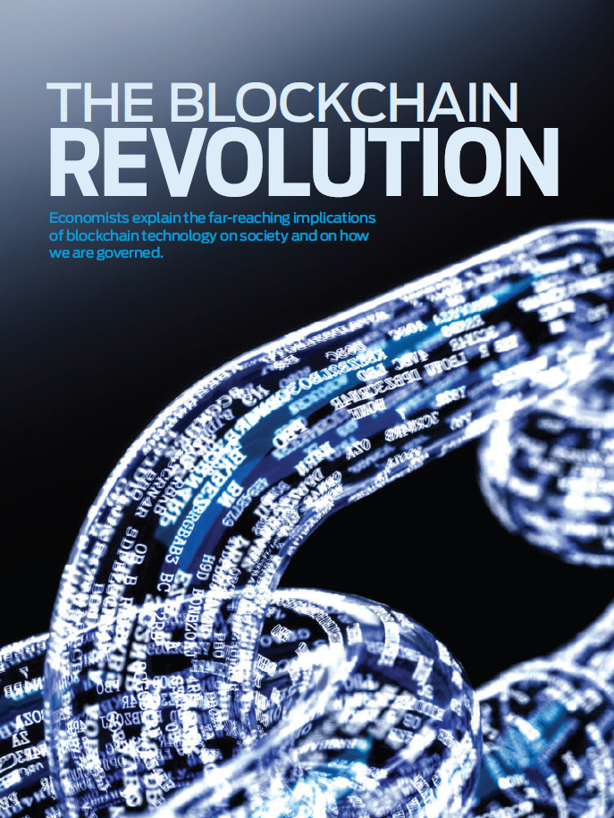
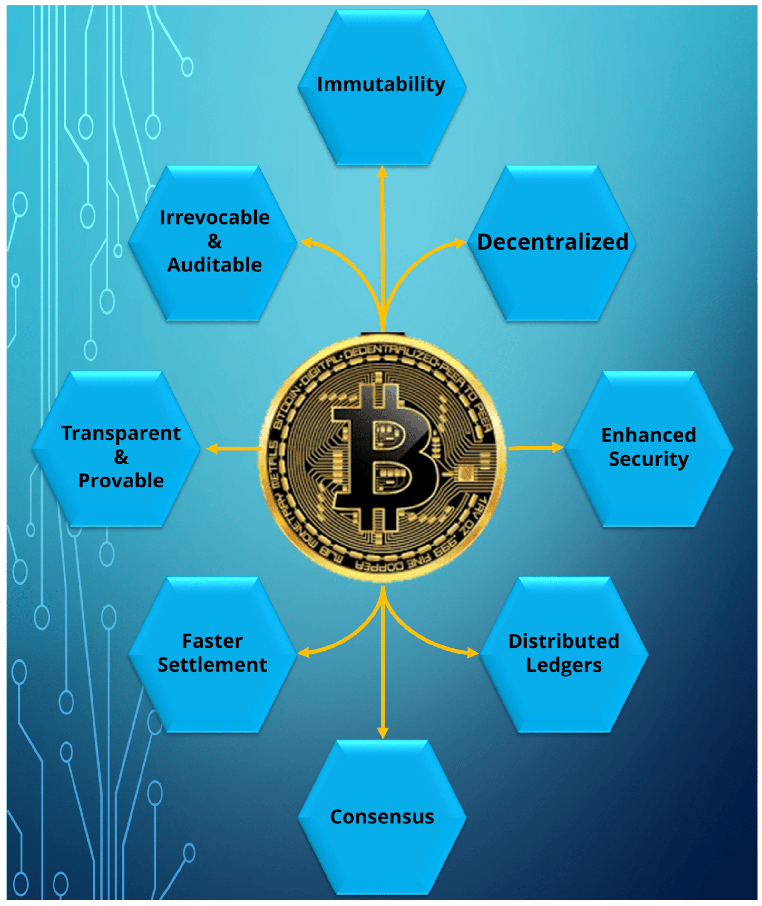
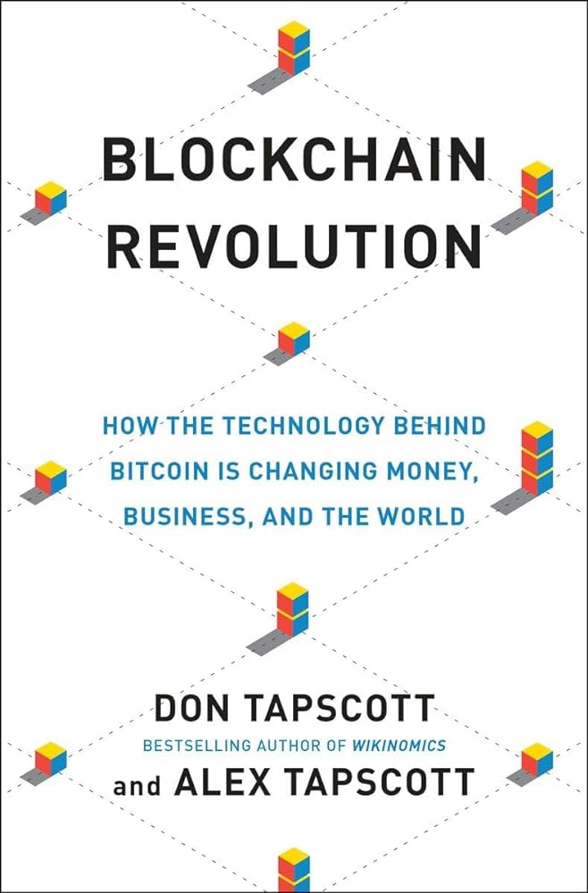

## About

Blockchain Revolution and Implications:

The concept of blockchain technology goes beyond cryptocurrencies, offering revolutionary potential in various industries by enabling decentralized and trustless systems. Blockchain, the technology behind Bitcoin, serves as a public ledger accessible to all participants without a central authority, ensuring transparency and security in transactions.

### Decentralized and Trustless Systems

- Blockchain technology allows for the creation of decentralized systems where transactions are recorded on a distributed ledger, eliminating the need for intermediaries and enhancing trust among participants.

- By utilizing cryptographic techniques and consensus mechanisms, blockchain ensures the integrity and immutability of data, making it resistant to tampering and fraud.

### Applications in Various Industries

- Blockchain technology finds applications in diverse sectors such as finance, supply chain management, healthcare, and more.

- In finance, blockchain enables faster and more secure transactions, reduces costs, and enhances transparency in processes like cross-border payments and trade finance.

- In supply chain management, blockchain improves traceability, authenticity, and efficiency by tracking products from origin to destination, combating counterfeiting and ensuring quality control.

- In healthcare, blockchain enhances data security, interoperability, and patient privacy by enabling secure sharing of medical records and streamlining processes like insurance claims and drug traceability.

### Potential Benefits of Blockchain Technology

- Increased Transparency: Blockchain provides a transparent and auditable record of transactions, enhancing accountability and reducing fraud.

- Enhanced Efficiency: By automating processes and reducing the need for manual reconciliation, blockchain improves operational efficiency and reduces costs.

- Heightened Security: The cryptographic nature of blockchain ensures data integrity and protection against unauthorized access, enhancing cybersecurity measures.

Blockchain technology's potential benefits extend beyond cryptocurrencies, offering transformative solutions for industries seeking enhanced security, efficiency, and transparency in their operations. As blockchain continues to evolve, its impact on various sectors is expected to drive innovation and reshape traditional business models.

## References:

1 https://www.gemini.com/cryptopedia/cryptocurrencies-vs-tokens-difference

2 https://www.investopedia.com/terms/d/digital-currency.asp

3 https://books.google.com/books/about/Blockchain_Revolution.html?id=NqBiCgAAQBAJ

4 https://www.goodreads.com/book/show/25894041-blockchain-revolution

5 https://www.amazon.in/Blockchain-Revolution-Technology-Cryptocurrencies-Changing/dp/0241237866