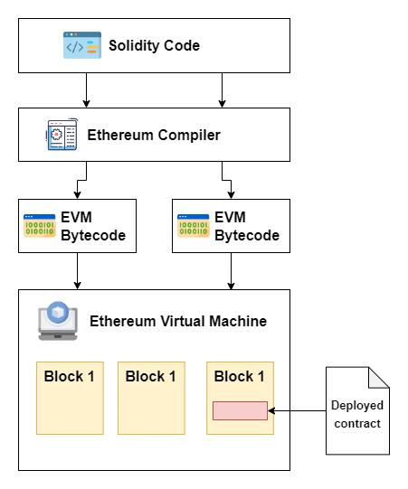
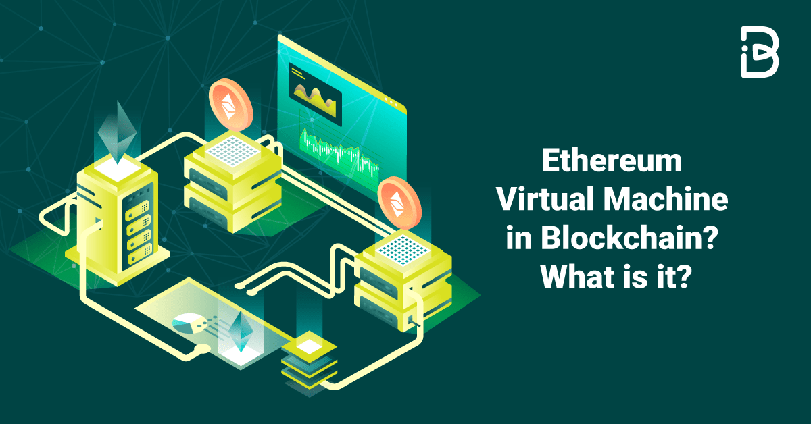

## About

Ethereum is a decentralized platform that revolutionizes the way applications are built and operated on the blockchain. It enables the creation of smart contracts and decentralized applications (DApps), offering a new paradigm for executing agreements and transactions without intermediaries.

### Basics of Ethereum

- Decentralized Platform: Ethereum operates on a decentralized network, allowing users to interact directly without the need for centralized control. This decentralization enhances security, transparency, and trust in transactions.

- Smart Contracts: Smart contracts are self-executing agreements coded on the Ethereum blockchain. These contracts automatically execute predefined conditions when met, enabling secure and transparent interactions.

### Ethereum Virtual Machine (EVM)

- The Ethereum Virtual Machine (EVM) is the runtime environment for smart contracts on the Ethereum network. It executes code written in smart contracts, ensuring consistency and accuracy across all nodes in the network.

- EVM enables the deployment of decentralized applications (DApps) by providing a secure and reliable execution environment for smart contract logic.

### Ether (ETH) and Its Role

- Ether (ETH) is the native cryptocurrency of the Ethereum platform, used for transactions, payments, and executing smart contracts. It serves as the fuel for operations on the Ethereum network.

- ETH plays a crucial role in facilitating transactions within DApps, incentivizing network participants, and securing the Ethereum blockchain through mining and staking mechanisms.

Ethereum's innovative approach to decentralized applications and smart contracts has positioned it as a leading platform for blockchain development. 

By leveraging the EVM and ETH, Ethereum offers a robust infrastructure for building a wide range of applications, from decentralized finance (DeFi) to non-fungible tokens (NFTs), reshaping the landscape of digital transactions and agreements.

## References:

1 https://www.gemini.com/cryptopedia/cryptocurrencies-vs-tokens-difference

2 https://www.investopedia.com/terms/d/digital-currency.asp

3 https://consensys.io/knowledge-base/ethereum

4 https://en.wikipedia.org/wiki/Ethereum

5 https://www.wisdomtree.eu/-/media/eu-media-files/other-documents/research/market-insights/introduction-to-ethereum.pdf