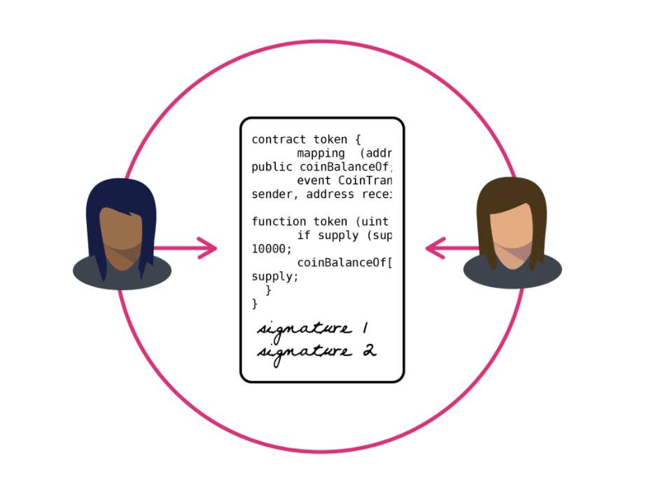

## About

## Smart Contract Development on Ethereum

Smart contract development on Ethereum empowers businesses and individuals to reshape the way transactions are conducted automatically in a decentralized manner. T

his article will explore the intricacies of smart contract development on Ethereum, highlighting its benefits, use cases, and the necessary steps followed by the best smart contract development company that assists in moving ahead on this exciting journey.

### Introduction to Smart Contracts

A "smart contract" is simply a program that runs on the Ethereum blockchain. It's a collection of code (its functions) and data (its state) that resides at a specific address on the Ethereum blockchain. 

Smart contracts are a type of Ethereum account, which means they have a balance and can be the target of transactions. However, they're not controlled by a user, instead they are deployed to the network and run as programmed. 

User accounts can then interact with a smart contract by submitting transactions that execute a function defined on the smart contract. Smart contracts can define rules, like a regular contract, and automatically enforce them via the code. Smart contracts cannot be deleted by default, and interactions with them are irreversible.

### Lifecycle of a Smart Contract

The lifecycle of a smart contract includes deployment, interaction, and termination. Deployment involves creating and deploying a smart contract to the Ethereum network. 

This is done by writing the smart contract code in a programming language like Solidity, compiling it, and then deploying it to the network. Interaction involves users interacting with the smart contract by submitting transactions that execute a function defined on the smart contract.

Termination involves the smart contract being deleted or updated, which can be done by the contract's owner or by the network itself.

### Patterns and Best Practices for Smart Contract Development

Common patterns and best practices for smart contract development include security considerations, gas optimization, and upgradability. Security considerations involve ensuring that the smart contract is secure and cannot be exploited by malicious actors. 

Gas optimization involves optimizing the smart contract's gas usage to ensure that it is efficient and cost-effective. Upgradability involves designing the smart contract to be easily upgradable, which allows for changes to be made to the contract without disrupting its functionality.

### Tools for Writing Smart Contracts

The evolution of tools available to create distributed applications based on smart contracts is impressive, given that Solidity was first proposed in 2014. Today, IDEs do most of the heavy lifting, allowing developers to focus on the logic of their smart contracts instead of the minutiae that goes with getting it all to work. 

There are two types of IDEs: hosted on a local machine and online and accessed from a web browser. IDEs for local machines include VS Code and JetBrains WebStorm. Online tools include Ethereum's Remix, which reduces the labor of creating Ethereum smart contracts by doing common development chores such as library management, code autocompletion, syntax checking, and even deployment.

## References:

1 https://www.gemini.com/cryptopedia/cryptocurrencies-vs-tokens-difference

2 https://www.investopedia.com/terms/d/digital-currency.asp

3 https://www.antiersolutions.com/smart-contract-development-on-ethereum-the-future-of-digital-transactions/

4 https://ethereum.org/en/developers/docs/smart-contracts/security/

5 https://www.deltecbank.com/2023/05/23/ethereums-smart-contracts-explained/