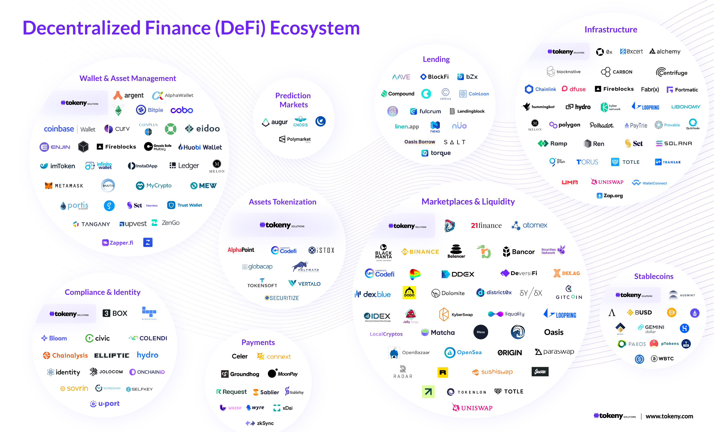
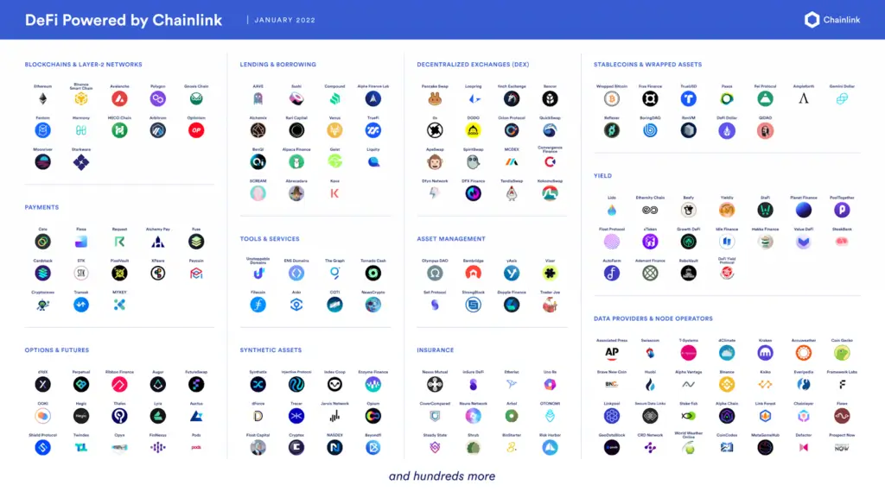
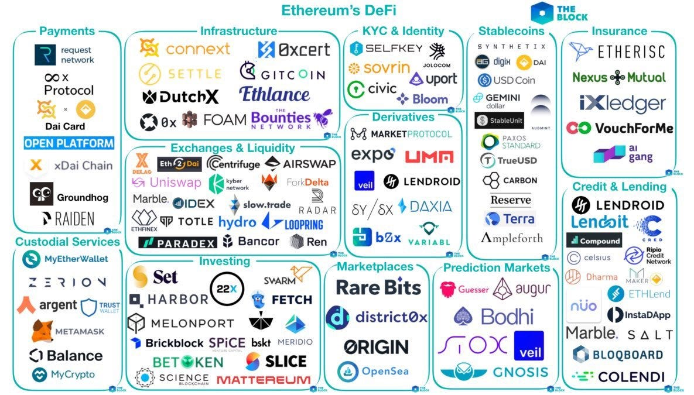
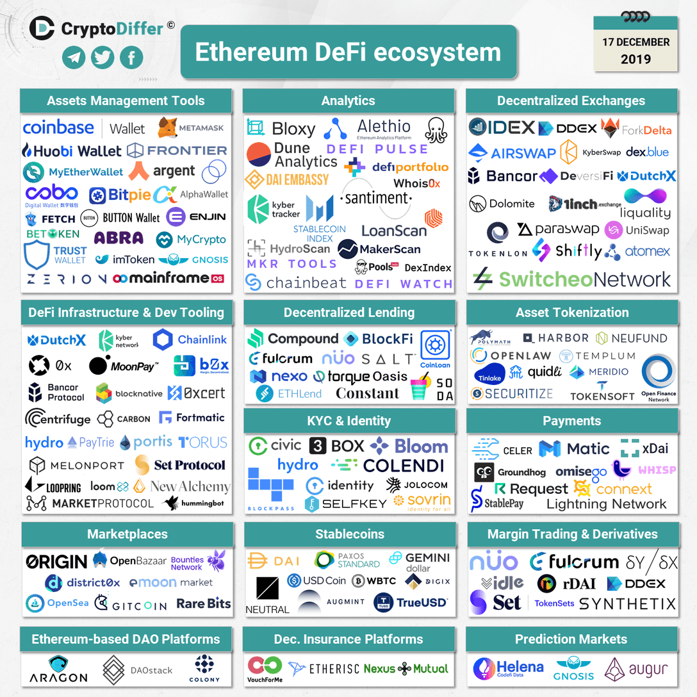

## About

## DeFi Ecosystem: Revolutionizing Finance on Ethereum

The decentralized finance (DeFi) ecosystem on the Ethereum platform is reshaping traditional financial services by leveraging blockchain technology to provide open, accessible, and transparent financial solutions. Let's delve into the DeFi ecosystem, exploring its components, popular projects, and the innovative use of smart contracts to revolutionize the financial landscape.

### Understanding DeFi Ecosystem

DeFi is a financial ecosystem that operates on a decentralized infrastructure, enabling peer-to-peer transactions without intermediaries. It encompasses various components that redefine financial services, including decentralized exchanges (DEXs), lending protocols, yield farming, and synthetic assets. These components leverage blockchain technology to create a transparent and inclusive financial system accessible to anyone with an internet connection.

### Components of DeFi Ecosystem

1. Decentralized Exchanges (DEXs): DEXs are platforms where users can trade cryptocurrencies directly without intermediaries, using smart contracts to facilitate trustless trades and ensure user control over funds.

2. Lending Protocols: Platforms like Aave, Compound, and MakerDAO enable users to lend and borrow cryptocurrencies using collateral, fostering a flexible and efficient lending market without traditional credit checks.

3. Yield Farming: Yield farming allows users to earn interest on their cryptocurrencies by providing liquidity to protocols, generating rewards for contributing to liquidity pools on DEXs.

4. Synthetic Assets: DeFi platforms offer synthetic assets that mirror the value of real-world assets, enabling users to access a diverse range of assets and investment opportunities in a decentralized manner.

### Popular DeFi Projects and Protocols

1. Uniswap: Uniswap is a leading DEX that allows users to swap tokens directly from their wallets, providing liquidity through automated market-making mechanisms powered by smart contracts.

2. Compound: Compound is a lending protocol that enables users to earn interest on deposited assets or borrow assets by collateralizing their holdings, all managed by smart contracts.

3. Aave: Aave is a decentralized lending platform that offers users the ability to earn interest on deposits and borrow assets, with unique features like flash loans that execute within a single transaction.

4. MakerDAO: MakerDAO is a decentralized autonomous organization (DAO) that governs the stablecoin Dai, collateralized by various assets, allowing users to mint Dai by locking collateral in smart contracts.

### Leveraging Smart Contracts in DeFi

Smart contracts play a pivotal role in the DeFi ecosystem by automating financial transactions, enabling secure and transparent interactions without intermediaries. Projects like Uniswap, Compound, Aave, and MakerDAO leverage smart contracts to provide lending, borrowing, trading, and stablecoin services, ensuring efficiency, security, and user control over financial assets.

## References:

1 https://www.gemini.com/cryptopedia/cryptocurrencies-vs-tokens-difference

2 https://www.investopedia.com/terms/d/digital-currency.asp

3 https://www.linkedin.com/pulse/defi-ecosystem-overview-its-structure-functionality

4 https://www.blog.bitfinity.network/exploring-the-defi-ecosystem-a-comprehensive-guide-to-decentralized-finance-for-beginners/

5 https://tokeny.com/defi-ecosystem/
