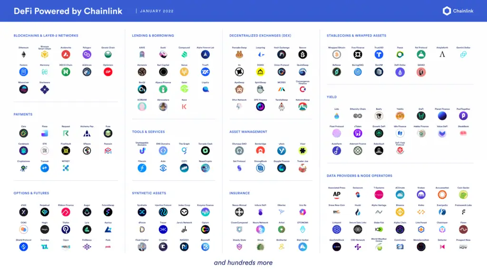
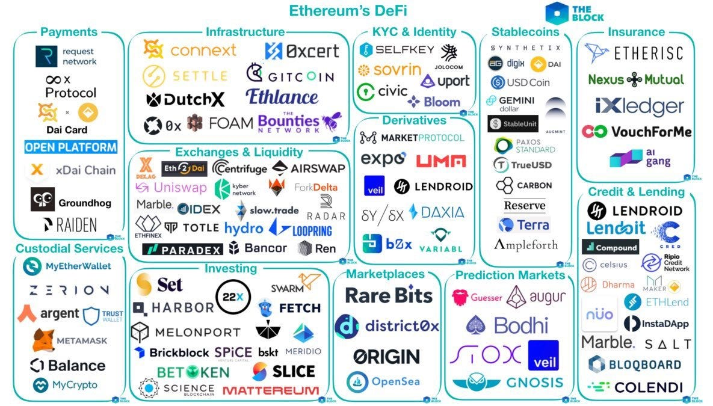

## About

## Overview of DeFi: Revolutionizing Finance through Decentralization

Decentralized finance (DeFi) is a rapidly growing ecosystem that aims to revolutionize traditional financial systems by leveraging blockchain technology to create open, transparent, and accessible financial services. DeFi offers a new paradigm for financial transactions, eliminating the need for centralized intermediaries and enabling peer-to-peer interactions through the use of smart contracts.

### Key Characteristics of DeFi

1. Decentralization: DeFi operates on decentralized networks, ensuring that no single entity controls the system. This decentralization enhances security, transparency, and user autonomy.

> Decentralized Finance Ecosystem

2. Transparency: All transactions and interactions within the DeFi ecosystem are recorded on a public blockchain, allowing for transparency and auditability.

3. Interoperability: DeFi protocols are designed to work together seamlessly, enabling the creation of complex financial applications by combining various DeFi building blocks.

4. Composability: DeFi's modular design allows developers to build upon existing protocols, creating new applications and services by composing various DeFi components.

### Core Building Blocks of DeFi

1. Decentralized Exchanges (DEXs): DEXs enable users to trade cryptocurrencies directly with each other without the need for a centralized exchange. Platforms like Uniswap and SushiSwap use automated market makers (AMMs) to facilitate trading.

2. Lending and Borrowing Protocols: DeFi lending platforms, such as Aave and Compound, allow users to lend and borrow cryptocurrencies using smart contracts. These protocols enable efficient and flexible lending markets without the need for traditional credit checks.

3. Stablecoins: They are cryptocurrencies designed to maintain a stable value, often pegged to real-world assets like the US dollar. Stablecoins like DAI and USDC play a crucial role in the DeFi ecosystem by providing a stable medium of exchange and reducing price volatility.

4. Synthetic Assets: DeFi enables the creation of synthetic assets that track the value of real-world assets, such as stocks, commodities, or other cryptocurrencies. These synthetic assets allow users to gain exposure to a wide range of assets without directly owning them.

The DeFi ecosystem continues to evolve rapidly, with new protocols and applications emerging regularly. As DeFi grows, it presents both opportunities and challenges for traditional financial systems, driving innovation and disruption in the financial industry.

## References:

1 https://www.gemini.com/cryptopedia/cryptocurrencies-vs-tokens-difference

2 https://www.investopedia.com/terms/d/digital-currency.asp

3 https://www.blog.bitfinity.network/exploring-the-defi-ecosystem-a-comprehensive-guide-to-decentralized-finance-for-beginners/

4 https://www.sciencedirect.com/science/article/pii/S2666603023000179

5 https://www.mdpi.com/1999-5903/16/3/76