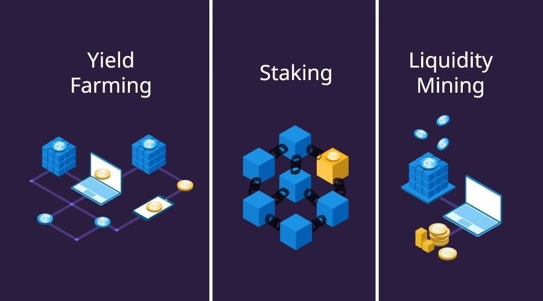
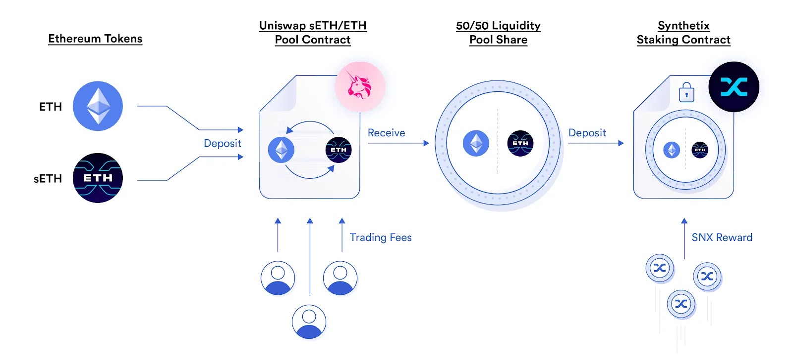
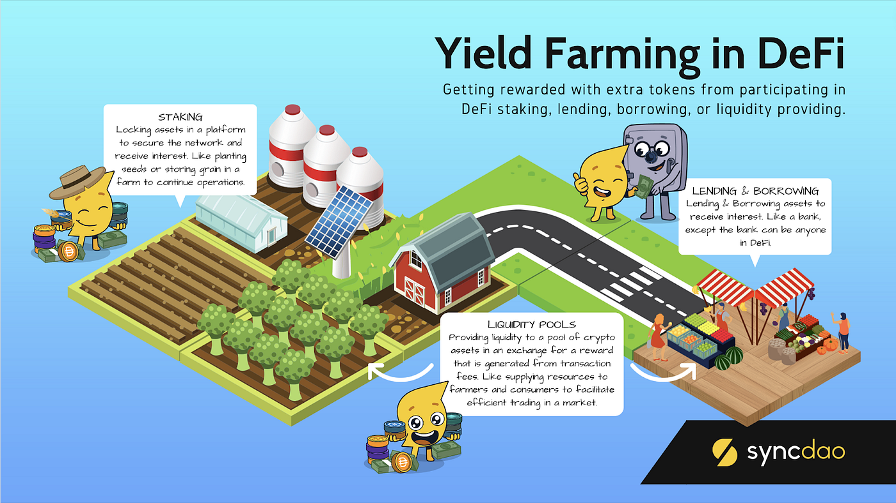

## About

## Yield Farming and Liquidity Mining: Earning Rewards in DeFi

Yield farming and liquidity mining are two closely related concepts that have gained significant traction in the decentralized finance (DeFi) ecosystem. These practices involve providing liquidity to DeFi protocols in exchange for rewards, allowing users to earn passive income on their cryptocurrency holdings.

### Understanding Yield Farming

Yield farming, also known as liquidity provision, is the process of staking or lending crypto assets to generate high returns or rewards in the form of additional tokens. Participants, known as liquidity providers (LPs), add their assets to liquidity pools, which power decentralized exchanges (DEXs) and other DeFi protocols.

In a typical yield farming scenario, a user might deposit a pair of tokens, such as Ethereum (ETH) and a stablecoin like DAI, into a DEX liquidity pool. In return, they receive LP tokens that represent their share of the pool. These LP tokens can then be staked in a farming contract that rewards users with additional tokens over time, such as the platform's native governance tokens.

### Liquidity Mining: Incentivizing Liquidity Provision

Liquidity mining is a subset of yield farming where participants earn tokens as an incentive for providing liquidity to a DeFi protocol. It serves as a bootstrapping mechanism for new protocols to distribute their tokens and attract users to their platform.

The rewards that liquidity miners receive are typically native tokens of the platform they are supporting. These incentives not only compensate for any potential losses due to impermanent loss but also serve as a mechanism for distributing governance tokens, allowing users to participate in the decision-making process of the protocol.

### Yield Farming Strategies and Techniques
Yield farmers often employ various strategies and techniques to maximize their returns. These include:

1. Liquidity Provision: Depositing funds into liquidity pools to earn a share of trading fees and platform rewards.

2. Staking: Locking up tokens to participate in the governance and security of a protocol, earning rewards in return.

3. Yield Optimization: Automatically moving funds between different protocols to optimize returns, often using yield aggregators or automated strategies.

### Risks and Considerations

While yield farming and liquidity mining offer the potential for high returns, they also come with risks that users should be aware of:

1. Impermanent Loss: The risk of losing value compared to simply holding the assets outside the liquidity pool, particularly in volatile markets.

2. Smart Contract Vulnerabilities: The potential for bugs or exploits in the smart contracts underlying DeFi protocols, which could lead to loss of funds.

3. Market Volatility: The inherent risk of investing in a highly volatile market, where token prices can fluctuate rapidly.

References:

1 https://www.gemini.com/cryptopedia/cryptocurrencies-vs-tokens-difference

2 https://www.investopedia.com/terms/d/digital-currency.asp

3 https://reintech.io/blog/understanding-yield-farming-liquidity-mining

4 https://academy.binance.com/en/articles/what-is-yield-farming-in-decentralized-finance-defi

5 https://b2broker.com/news/yield-farming-vs-liquidity-mining-whats-the-difference/