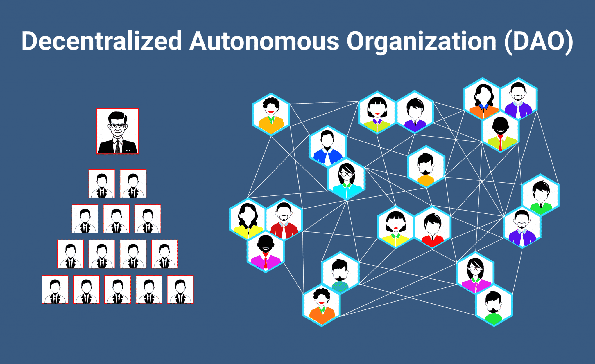
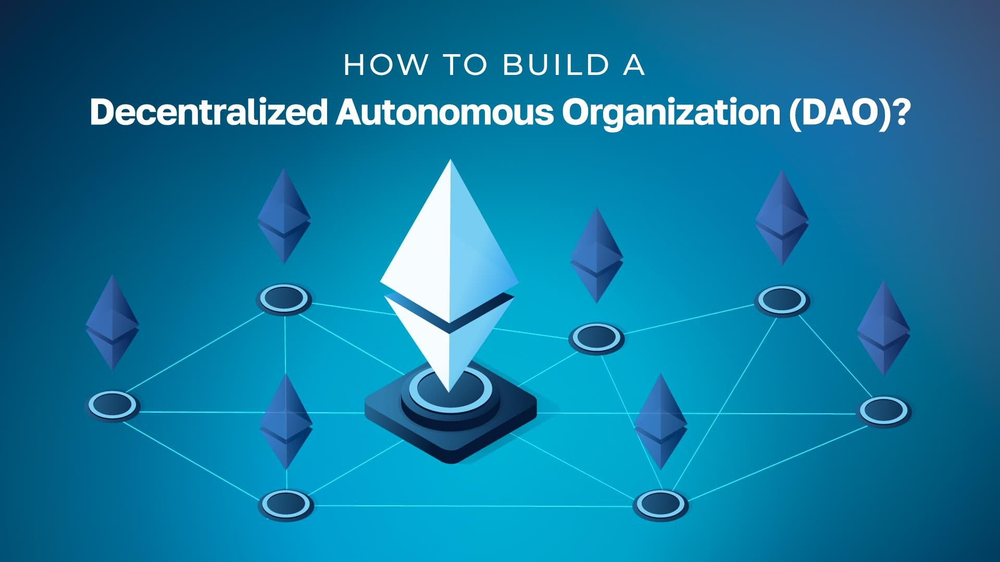
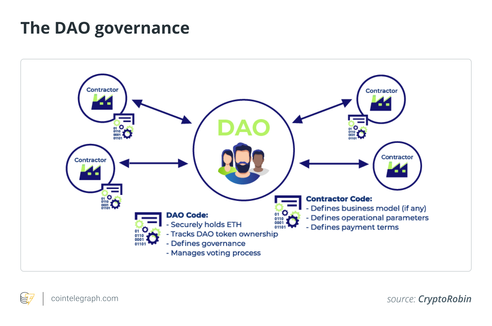

## About

## Decentralized Lending and Borrowing Protocols

Decentralized lending and borrowing protocols are a crucial component of the decentralized finance (DeFi) ecosystem, enabling users to lend and borrow digital assets without intermediaries. These protocols have revolutionized the way people access and manage their digital assets, providing a new paradigm for financial transactions.

### Mechanisms Behind Lending and Borrowing

1. Collateralization: In decentralized lending and borrowing protocols, users provide collateral in the form of digital assets to secure their loans. This collateral is used to cover any potential losses if the borrower defaults on the loan.

2. Interest Rates: Lending and borrowing protocols often charge interest rates to borrowers, which are typically expressed as a percentage of the loan amount. These interest rates can be fixed or variable, depending on the protocol's design.

3. Liquidation Processes: In the event of a borrower defaulting on a loan, the protocol's liquidation process is triggered. This process involves selling the borrower's collateral to cover the outstanding loan balance and any accrued interest.

### Decentralized Autonomous Organizations (DAOs) and Governance Tokens

1. Decentralized Autonomous Organizations (DAOs): DAOs are decentralized organizations that operate on a blockchain, allowing for decentralized decision-making and governance. In the context of lending and borrowing protocols, DAOs can be used to govern the protocol's operations, including setting interest rates and collateralization ratios.

2. Governance Tokens: Governance tokens are a type of token that allows holders to participate in the governance of a protocol. In the context of lending and borrowing protocols, governance tokens can be used to vote on proposals for changing the protocol's operations, such as adjusting interest rates or collateralization ratios.

### Benefits of Decentralized Lending and Borrowing

1. Transparency: Decentralized lending and borrowing protocols offer unprecedented transparency, as all transactions and loan terms are publicly visible on the blockchain.

2. Automated Enforcement: The rules governing lending and borrowing are hard-coded into smart contracts, ensuring automatic and guaranteed enforcement without the need for intermediaries.

3. Lower Costs: By eliminating intermediaries and automating processes, decentralized lending and borrowing protocols can significantly reduce transaction costs for both lenders and borrowers.

### Popular Lending and Borrowing Protocols

1. MakerDAO: MakerDAO is a decentralized autonomous organization (DAO) that develops technology for borrowing, lending, and savings on the Ethereum blockchain, and launched the DAI digital currency, a stablecoin pegged to the US dollar.

2. Compound: Compound is a decentralized lending and borrowing protocol that allows users to lend and borrow Ethereum-based tokens. It uses a decentralized autonomous organization (DAO) to govern its operations.

3. Aave: Aave is a decentralized lending and borrowing protocol that allows users to lend and borrow Ethereum-based tokens. It uses a decentralized autonomous organization (DAO) to govern its operations.

Decentralized lending and borrowing protocols have the potential to revolutionize the financial industry by providing more accessibility, choice, and control to individuals and institutions. However, they also raise new challenges and risks, including regulatory uncertainty and potential security vulnerabilities.

## References:

1 https://www.gemini.com/cryptopedia/cryptocurrencies-vs-tokens-difference

2 https://www.investopedia.com/terms/d/digital-currency.asp

3 https://arxiv.org/html/2312.01018v1

4 https://www.linkedin.com/pulse/how-decentralized-finance-defi-lending-borrowing-trading-robbins-2dozc

5 https://dergipark.org.tr/en/download/article-file/2989413