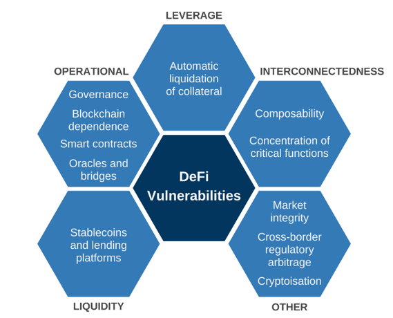

## About

Decentralized Finance (DeFi) has revolutionized the financial industry by providing a new paradigm for financial transactions, eliminating intermediaries, and offering greater control and flexibility to individuals and institutions. However, like any innovative technology, DeFi also presents various risks and challenges that must be carefully considered before participating in the ecosystem.

### Risks in DeFi

1. Smart Contract Vulnerabilities: Smart contracts are the foundation of DeFi, but they are also vulnerable to various flaws, including logic errors, economic exploits, flash loan attacks, and governance risks. These vulnerabilities can lead to significant losses for users and damage the reputation of DeFi platforms.

2. Impermanent Loss: DeFi users may experience impermanent loss due to market , which can result in significant losses if not managed properly. This risk is particularly significant for users who are new to DeFi or lack experience in managing their assets.

3. Liquidity Risks: DeFi protocols may encounter liquidity problems, which can lead to volatility and price changes. This risk is particularly significant for users who rely on liquidity to execute trades or manage their assets.

4. Regulatory Uncertainty: DeFi is still largely unregulated, which can create uncertainty and risks for users. Regulatory changes or ambiguity can impact the value of DeFi assets and the overall ecosystem.

### Opportunities in DeFi

1. Access to Financial Services for Underserved Populations: DeFi offers a new paradigm for financial services, providing access to financial tools and services for underserved populations who may not have access to traditional financial institutions.

2. Efficiency Gains: DeFi can significantly reduce transaction costs and increase efficiency by eliminating intermediaries and automating processes.

3. Composability with Other Blockchain Protocols: DeFi's composability with other blockchain protocols enables the creation of complex financial applications and services, offering new opportunities for innovation and growth.

4. Yield Farming: Yield farming is a new way to earn incentives by supplying liquidity to DeFi protocols, providing a potential source of passive income for users.

## References:

1 https://www.gemini.com/cryptopedia/cryptocurrencies-vs-tokens-difference

2 https://www.investopedia.com/terms/d/digital-currency.asp

3 https://blogs.cfainstitute.org/investor/2022/06/07/defi-ing-the-rules-five-opportunities-and-five-risks-of-decentralized-finance/

4 https://www.analyticsinsight.net/top-10-opportunities-and-risks-of-decentralized-finance/

5 https://www.coursera.org/learn/decentralized-finance-opportunities-and-risk-duke