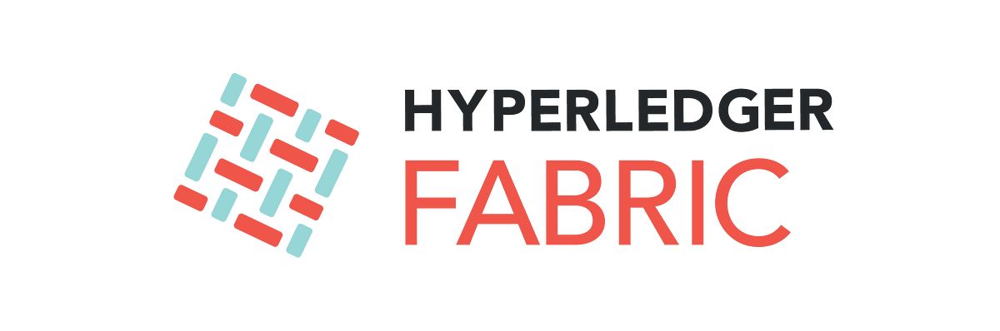
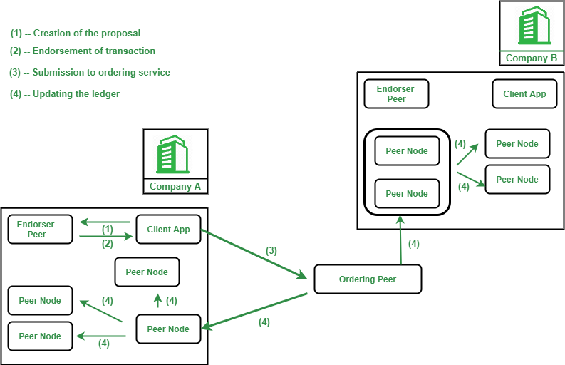
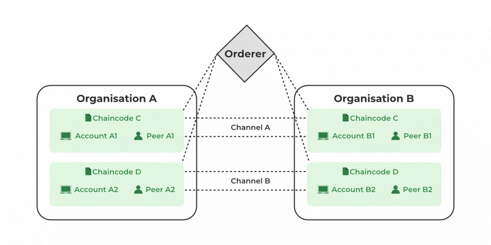
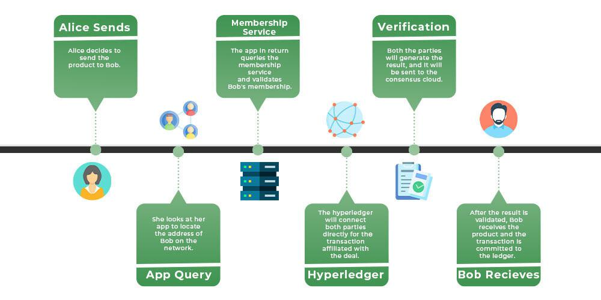

## About

Hyperledger Fabric is a permissioned blockchain platform designed for enterprise use, offering a modular and flexible architecture that enables the development of robust, industry-specific applications. It provides a secure and scalable environment for businesses to build and deploy blockchain-based solutions, addressing the unique challenges and requirements of the enterprise landscape.

### Understanding Hyperledger Fabric

Hyperledger Fabric is an open-source project hosted by the Linux Foundation, developed by a global community of contributors. It is designed to be a permissioned blockchain, meaning that participants must be identified and authorized to join the network. 

This approach ensures a high level of trust and privacy, making it suitable for enterprise use cases that require controlled access and confidentiality.

### Architecture of Hyperledger Fabric

Hyperledger Fabric employs a modular architecture, allowing for the customization and integration of various components to suit specific business needs. Its key architectural features include:

1. Modular Design: Hyperledger Fabric's modular design enables the replacement of individual components, such as consensus protocols and membership services, without affecting the overall system.

2. Consensus Mechanisms: Hyperledger Fabric supports multiple consensus mechanisms, including Kafka and Raft, allowing enterprises to choose the most suitable option based on their requirements.

3. Endorsement Policies: Endorsement policies define the set of peers that must endorse a transaction before it can be committed to the ledger. These policies ensure that transactions are validated according to predefined rules.

### Key Components of Hyperledger Fabric

1. Peers: Peers are the fundamental components of the Hyperledger Fabric network, responsible for hosting the ledger and executing chaincode (smart contracts).

2. Ordering Service: The ordering service is responsible for collecting endorsed transactions from peers, ordering them chronologically, and packaging them into blocks for distribution to all peers.

3. Membership Service Provider (MSP): The MSP manages the identities of participants in the Hyperledger Fabric network, ensuring that only authorized entities can join and interact with the blockchain.

4. Channels: Channels are private "subnets" of communication between two or more specific network members, allowing for data isolation and confidentiality.

### Benefits of Hyperledger Fabric

1. Permissioned Network: Hyperledger Fabric's permissioned nature ensures that only authorized entities can participate in the network, enhancing security and trust.

2. Scalability: Hyperledger Fabric's modular design and support for multiple consensus mechanisms enable it to scale to accommodate the needs of enterprise-level applications.

3. Privacy and Confidentiality: Hyperledger Fabric provides privacy and confidentiality through features like channels, which allow for data isolation and selective sharing.

4. Flexibility: The platform's modular architecture and support for multiple programming languages (e.g., Go, Node.js, Java) make it flexible and adaptable to various enterprise use cases.

Hyperledger Fabric has been widely adopted by enterprises across various industries, including finance, supply chain, healthcare, and more. Its robust architecture and enterprise-focused features make it a compelling choice for businesses looking to leverage blockchain technology in their operations.