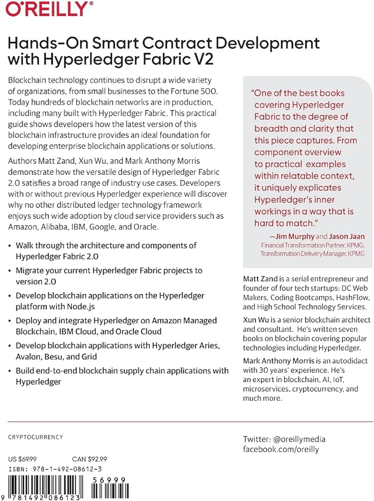
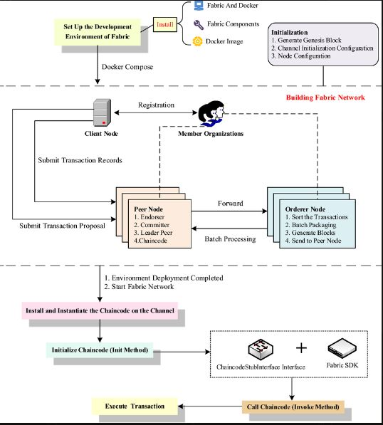

## About

Hyperledger Fabric provides a robust platform for developing and deploying smart contracts, known as chaincode, to enable complex business logic and transactions within the blockchain network. This section will guide you through the practical aspects of smart contract development on Hyperledger Fabric, covering the process of writing, deploying, and interacting with chaincode.

### Writing Smart Contracts

Hyperledger Fabric supports multiple programming languages for writing smart contracts, including Go and JavaScript. Developers can choose the language that best suits their preferences and the requirements of the application.

When writing chaincode, developers define the business logic, data structures, and functions that will be executed on the blockchain. This includes defining the input parameters, return values, and the overall flow of the smart contract.

### Deploying Smart Contracts

To deploy a smart contract on the Hyperledger Fabric network, developers must package the chaincode and submit it to the network. This process involves creating a chaincode package, which includes the smart contract code and its dependencies.

Once the chaincode package is created, it can be installed on the endorsing peers in the network. After installation, the chaincode must be instantiated on a specific channel, which defines the endorsement policies and initial state of the smart contract.

### Interacting with Smart Contracts

Client applications interact with deployed smart contracts through transaction proposals. These proposals are sent to endorsing peers, who simulate the execution of the chaincode and return a proposal response.

The client application collects the required number of endorsements based on the endorsement policy and submits the transaction to the ordering service. The ordering service then packages the transaction into a block and distributes it to all peers on the channel.

Finally, the peers validate the transaction and commit it to their local copy of the ledger, updating the state of the smart contract accordingly.

### Best Practices and Considerations

When developing smart contracts on Hyperledger Fabric, it's essential to follow best practices and consider various factors, such as:

1. Security: Ensure that the smart contract code is secure and free from vulnerabilities that could lead to potential exploits or data breaches.

2. Performance: Optimize the smart contract code for performance, considering factors such as the complexity of operations, data storage, and the number of transactions.

3. Upgradability: Design the smart contract with upgradability in mind, allowing for future modifications and improvements without disrupting the existing application.

4. Testing: Thoroughly test the smart contract using unit tests, integration tests, and end-to-end tests to ensure its correctness and reliability.

By following these best practices and leveraging the tools and resources provided by Hyperledger Fabric, developers can create robust and secure smart contracts that power enterprise-grade blockchain applications.