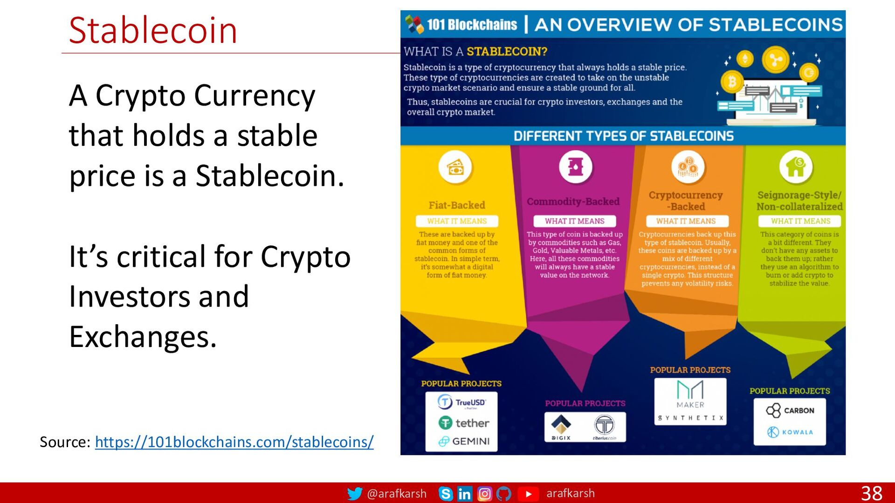

## About

### Security Token and Stablecoins Implementation on Hyperledger Fabric

Security tokens and stablecoins play a significant role in the digital asset markets, offering unique features and benefits for investors and users. Implementing these digital assets on the Hyperledger Fabric platform involves designing, developing, and deploying smart contracts and network infrastructure tailored to the specific requirements of security tokens and stablecoins.

#### Security Tokens

Security tokens represent ownership of real-world assets, such as equity, debt, or real estate, in a digital form. These tokens are subject to securities regulations and provide investors with ownership rights and potential dividends or interest payments. Implementing security tokens on Hyperledger Fabric involves creating smart contracts that define the token's properties, ownership rules, and compliance requirements.

#### Stablecoins

Stablecoins are digital assets designed to maintain a stable value by pegging them to a fiat currency or a basket of assets. These tokens provide stability in volatile markets and serve as a reliable medium of exchange and store of value. Developing stablecoins on Hyperledger Fabric requires creating smart contracts that manage the issuance, redemption, and stability mechanisms of the stablecoin.

#### Implementation Process

1. Design Phase: Define the properties and functionalities of the security tokens and stablecoins, including token issuance, transferability, compliance features, and stability mechanisms.

2. Development Phase: Write smart contracts in languages supported by Hyperledger Fabric, such as Go, Java, or Node.js, to implement the logic and rules governing the security tokens and stablecoins.

3. Deployment Phase: Deploy the smart contracts on the Hyperledger Fabric network, instantiate the tokens, and configure the network to support the issuance, transfer, and management of security tokens and stablecoins.

4. Testing and Optimization: Conduct thorough testing of the smart contracts to ensure their functionality, security, and compliance with regulatory requirements. Optimize the performance and efficiency of the security token and stablecoin solutions on the Hyperledger Fabric platform.

By following best practices in smart contract development, compliance, and network configuration, organizations can successfully implement security tokens and stablecoins on the Hyperledger Fabric platform, providing users with secure, compliant, and stable digital assets for various financial applications.

## References:

1 https://www.investopedia.com/terms/d/digital-currency.asp

2 https://www.gemini.com/cryptopedia/cryptocurrencies-vs-tokens-difference

3 https://www.shroffpublishers.com/index.php?attachment_id=1547&dispatch=attachments.getfile

4 https://www.amazon.com/Hands-Contract-Development-Hyperledger-Fabric/dp/1492086126

5 https://www.packtpub.com/product/hyperledger-cookbook/9781789534887