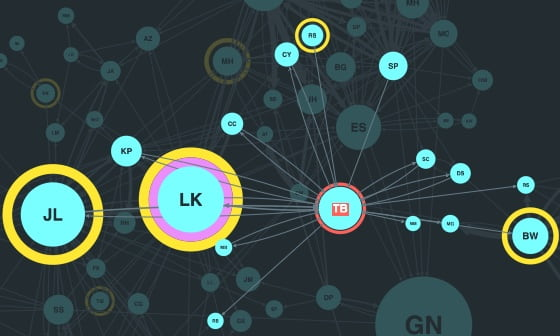

## About

### Understanding NoSQL Databases

NoSQL databases, also known as non-relational databases, are designed for scalability, flexibility, and high performance, making them ideal for handling large volumes of unstructured and semi-structured data. These databases offer a different approach to data storage and management compared to traditional relational databases, providing unique advantages and use cases in modern applications.

#### Fundamentals of NoSQL Databases

NoSQL databases are a type of database management system that diverges from the traditional relational model by offering flexible data models that can adapt to changing data structures. They are designed to handle and store large volumes of unstructured and semi-structured data efficiently, making them well-suited for applications with dynamic data requirements and scalability needs.

#### Types of NoSQL Databases

1. Document-Oriented Databases: These databases store data as documents, typically in JSON or XML format, allowing for flexible schemas and nested data structures. Examples include MongoDB and CouchDB.

2. Key-Value Stores: Key-value databases store data as simple key-value pairs, offering fast read and write operations. They are efficient for caching and session management. Redis and DynamoDB are popular key-value stores.

3. Column-Oriented Databases: Column-family databases organize data into columns rather than rows, making them suitable for analytical queries and aggregations. Cassandra and HBase are prominent column-oriented databases.

4. Graph Databases: Graph databases represent data as nodes and edges, enabling the storage and querying of complex relationships. They excel in applications requiring relationship analysis and network modeling. Examples include Neo4j and Amazon Neptune.

#### Characteristics and Advantages of NoSQL Databases

- Flexible Data Models: NoSQL databases offer schema-less or flexible schemas, allowing developers to store and retrieve data without predefined structures.
- Scalability: NoSQL databases can scale horizontally to handle large volumes of data and high user loads, making them suitable for modern applications with growing data requirements.
- Performance: NoSQL databases optimize read and write operations for speed and efficiency, providing fast access to data and supporting real-time analytics and processing.
- Use Cases: NoSQL databases are commonly used in applications like social media analytics, e-commerce, gaming, content management, and real-time data processing due to their scalability and flexibility.

By understanding the fundamentals of NoSQL databases and their diverse types, characteristics, and advantages, developers and organizations can leverage these databases to build scalable, flexible, and high-performance applications that meet the demands of modern data-intensive environments.

References:

1 https://www.gemini.com/cryptopedia/cryptocurrencies-vs-tokens-difference

2 https://www.investopedia.com/terms/d/digital-currency.asp

3 https://www.mongodb.com/nosql-explained

4 https://www.geeksforgeeks.org/introduction-to-nosql/

5 https://www.edx.org/learn/nosql/ibm-nosql-database-basics