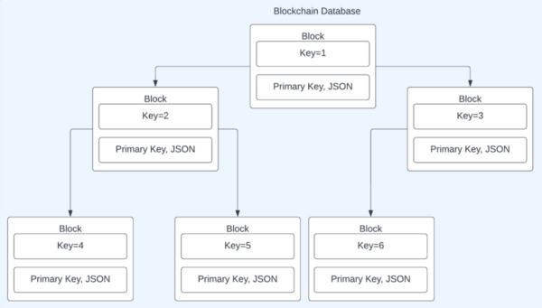
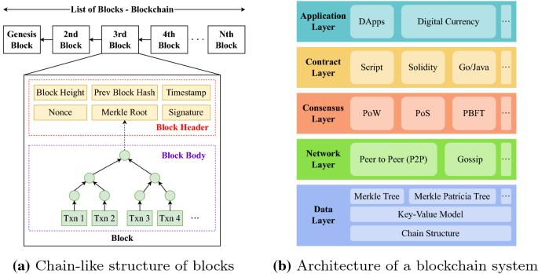

## About

## Integration of NoSQL with Blockchain Applications

NoSQL databases are well-suited for integrating with blockchain applications to enhance data management and scalability. By using NoSQL to store off-chain data, blockchain applications can benefit from the flexibility, performance and scalability advantages of NoSQL while still leveraging the immutability and decentralization of the blockchain for critical data.

### Storing Off-Chain Data in NoSQL

NoSQL databases can be used to store large volumes of unstructured off-chain data related to blockchain applications, such as:

- User profiles and account information
- Transaction records and history 
- Application state and configuration
- Metadata associated with on-chain data

For example, a decentralized finance (DeFi) application built on a blockchain could use a NoSQL database like MongoDB to store user account details, transaction histories, and application settings. The blockchain would be used to record the actual financial transactions in an immutable ledger, while the NoSQL database would handle the user-facing application data.

### Synchronizing NoSQL and Blockchain Data

To ensure consistency between the NoSQL database and blockchain, strategies are needed to synchronize the data between the two systems. Some approaches include:

- Triggering updates to the NoSQL database whenever new blocks are added to the blockchain
- Storing hash pointers in the blockchain that reference off-chain data in the NoSQL database
- Using NoSQL as a caching layer to provide fast access to the current state derived from blockchain transactions

For example, when a new block is mined and added to the blockchain, a trigger could be fired to update the corresponding user balances, transaction details and application state in the NoSQL database. The NoSQL database would then serve as a fast, flexible data store for the application to query, while the blockchain maintains the immutable record of transactions.

### Benefits of NoSQL Integration

Integrating NoSQL databases with blockchain applications provides several advantages:

- Enables storing large volumes of unstructured data that would be impractical on the blockchain itself
- Provides flexible schemas to handle semi-structured data related to blockchain transactions
- Offers higher throughput and faster queries compared to on-chain data storage
- Allows caching of derived state to speed up application queries
- Enables storing binary data like images and files that are difficult to store on a blockchain

By combining the strengths of NoSQL databases and blockchain technology, developers can build robust, scalable and performant blockchain applications that meet the needs of real-world use cases.

References:

1 https://www.xcubelabs.com/blog/nosql-databases-unlocking-the-power-of-non-relational-data-management/

2 https://bitcoinke.io/2022/03/why-use-nosql-together-with-blockchain-technology/

3 https://www.researchgate.net/publication/370593850_Development_of_an_Hybrid_Blockchain_and_NoSQL_Platform_to_Improve_Data_Management

4 https://www.linkedin.com/pulse/understanding-databases-relationship-blockchain-technology

5 https://www.raghuveer.page/how-sql-nosql-databases-enable-blockchain-applications-to-become-gdpr-compliant/