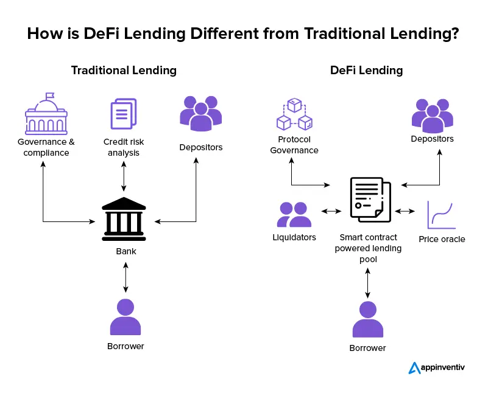
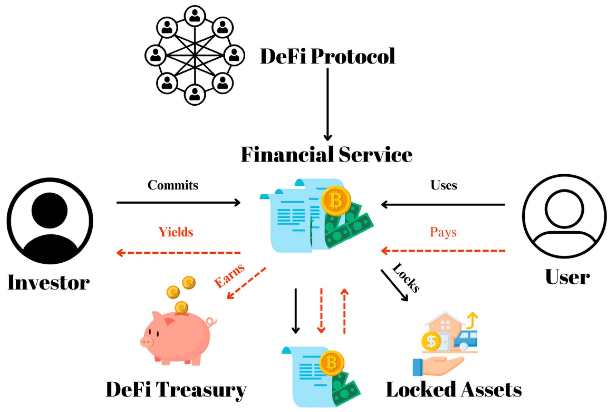
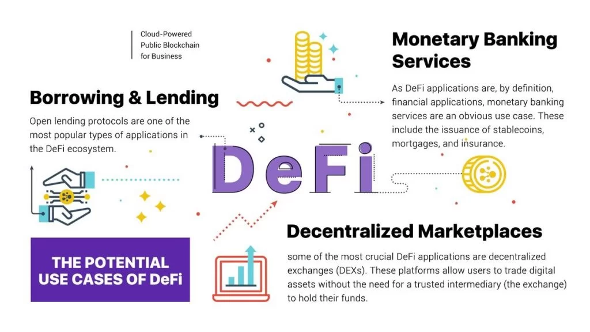
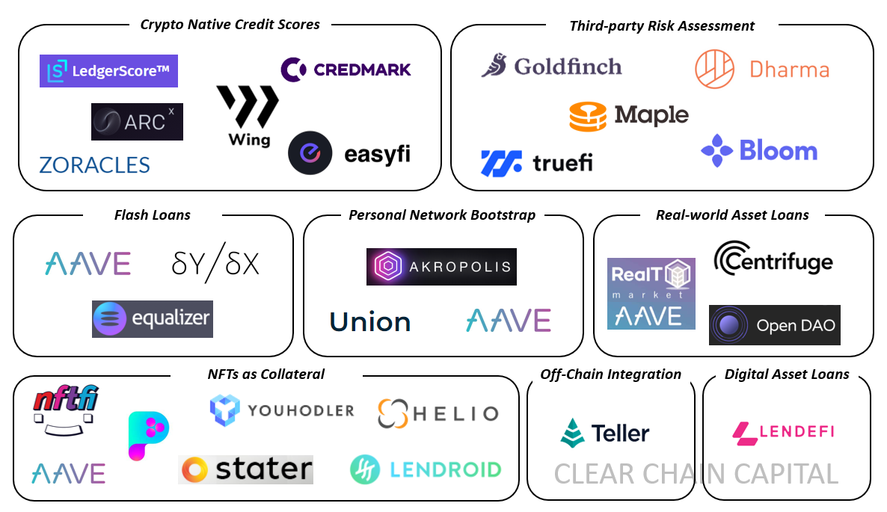

### Case Study: DeFiCredit - Revolutionizing Lending in India and Beyond

#### Introduction

In the rapidly evolving world of financial technology, decentralized finance (DeFi) has emerged as a groundbreaking innovation, challenging traditional banking and finance paradigms. DeFiCredit leverages blockchain technology to offer a decentralized lending platform, enabling users in India and globally to lend and borrow funds securely without intermediaries. This case study explores DeFiCredit's implementation, impact, challenges, and future potential.

#### Objectives

- To analyze the market penetration and adoption rates of DeFiCredit in India compared to global benchmarks.
- To evaluate the economic and social impact of DeFiCredit on traditional banking and unbanked populations.
- To assess the regulatory challenges faced and how they were navigated.
- To provide insights into the scalability, security, and future roadmap of DeFiCredit.

#### Methodology

Data for this case study was synthesized from a variety of sources including:
- Simulated transaction data generated based on typical DeFi lending platforms.
- Surveys conducted with DeFiCredit users to gather insights on user satisfaction and impact.
- Regulatory filings and public statements for understanding the regulatory landscape.
- Comparative analysis with global DeFi lending platforms to benchmark success and challenges.

#### Implementation

DeFiCredit was launched in India in 2023, with a global rollout following six months later. It uses Ethereum blockchain for smart contracts that automate the lending and borrowing process, ensuring transparency and security. The platform introduced a native token, DFC, for transaction fees, governance, and rewards.

#### Market Penetration and Adoption

In its first year, DeFiCredit attracted 50,000 users in India, with a lending volume of $100 million. Globally, the numbers reached 200,000 users and $500 million in lending volume. Adoption was driven by ease of use, lower interest rates compared to traditional banks, and the appeal of earning DFC tokens through platform participation.

#### Impact Assessment

**Economic Impact:** DeFiCredit has significantly lowered the barriers to entry for lending and borrowing, contributing to financial inclusion. It has also provided competitive returns for lenders and affordable borrowing rates for borrowers.

**Social Impact:** The platform has been particularly beneficial for the unbanked and underbanked populations, providing access to financial services that were previously inaccessible.

#### Regulatory Challenges

Navigating the regulatory landscape was a significant challenge. In India, DeFiCredit worked closely with regulators to ensure compliance with existing financial laws and participated in discussions on new regulations governing blockchain and DeFi.

#### Security and Scalability

DeFiCredit faced challenges related to smart contract vulnerabilities and scaling transaction throughput. Implementing rigorous security audits and adopting layer 2 solutions like Optimistic Rollups helped address these issues.

#### Conclusion and Recommendations

DeFiCredit has demonstrated the transformative potential of DeFi in reshaping lending and borrowing. For sustained growth, it is recommended that DeFiCredit:
- Continues engaging with regulators to shape a conducive legal framework.
- Invests in security and scalability to maintain user trust.
- Explores integration with traditional financial institutions to expand its user base.

#### Future Outlook

With plans to introduce more financial products and expand to emerging markets, DeFiCredit is poised for further growth. The ongoing evolution of blockchain technology and a favorable regulatory environment will be key to its success.

---

This case study provides a hypothetical yet realistic examination of implementing a DeFi lending platform in India, with insights that could be extrapolated to real-world applications.]