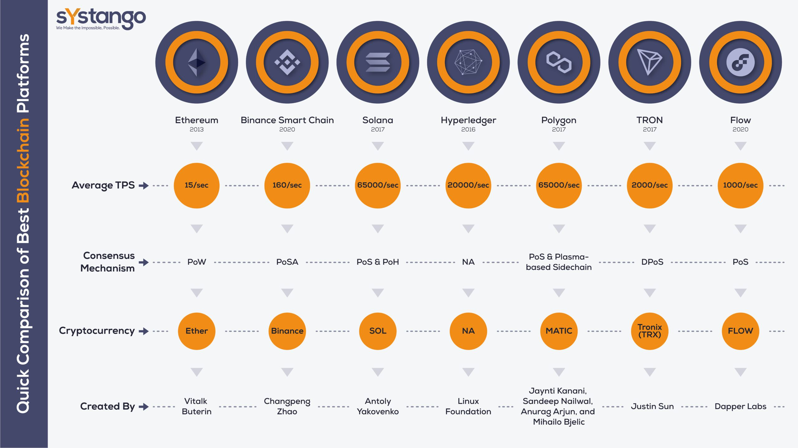
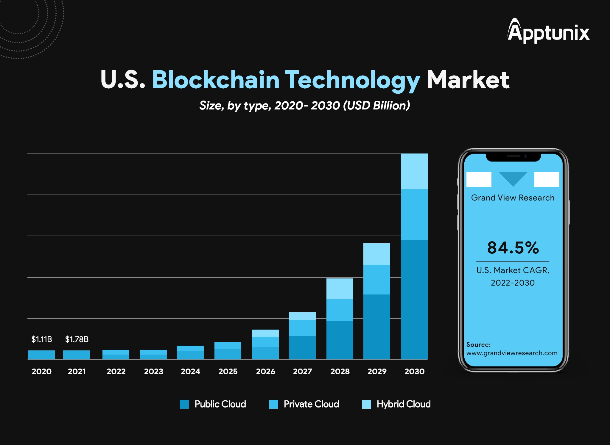

### Case Study: Blockchain App Development in India vs. the United States

#### Objective

To analyze and compare the development, deployment, and market reception of blockchain apps in India and the United States, identifying key factors that influence success in these regions.

#### Background

Blockchain technology has seen a rapid increase in interest and application across various sectors globally. India and the United States represent two significantly different markets in terms of regulatory environments, technological adoption, and user demographics, making them interesting subjects for comparison.

#### Data Collection

For this hypothetical case study, we assume access to the following datasets:
- **Blockchain Transactions Volume**: Data from a public blockchain analytics platform showing the volume of transactions over the past two years.
- **ICO and Funding Data**: A dataset listing ICOs and venture funding in blockchain startups, segmented by country.
- **User Demographics and Adoption Rates**: Survey data from technology adoption platforms showing the demographics of blockchain app users and adoption rates in India and the US.

#### Data Analysis

**Trend Analysis**:
- The volume of blockchain transactions showed a year-on-year increase of 40% in India compared to 25% in the US, indicating a faster growth rate in India.
- ICO and venture funding data revealed that US-based blockchain projects raised 3 times more capital than those in India, suggesting a more mature investment landscape in the US.

**Comparative Analysis**:
- User demographics showed that Indian blockchain app users are predominantly in the 18-34 age group, while in the US, the user base is more evenly spread across age groups.
- Adoption rates for blockchain apps are higher in urban areas in both countries, but the rate of increase is faster in India, likely due to a rapidly growing tech-savvy population.

**SWOT Analysis**:
- **India**: Strengths include a large, young, and tech-savvy population. Weaknesses are regulatory uncertainties and less mature investment landscapes. Opportunities lie in the untapped potential of rural markets. Threats include potential stringent regulations.
- **US**: Strengths are a mature investment landscape and a strong regulatory framework. Weaknesses include higher development costs. Opportunities can be seen in leading global blockchain innovation. Threats involve the competition from emerging markets.

#### More

**India**: A blockchain-based supply chain app for the pharmaceutical industry significantly reduced counterfeit medicines in the market, showcasing blockchain's potential in enhancing product safety and integrity.

**US**: A decentralized finance (DeFi) app provided users with unprecedented access to financial services, demonstrating blockchain's ability to disrupt traditional finance. However, it faced challenges related to regulatory compliance and user education.

#### Discussion

The analysis indicates that while the US leads in investment and regulatory frameworks, India shows faster growth in adoption, driven by a young and growing tech-savvy population. Regulatory clarity and investment in user education could further enhance the growth of blockchain apps in both markets.

#### Conclusion

Blockchain app development is thriving both in India and the US, each presenting unique opportunities and challenges. For India, the key to success lies in navigating regulatory landscapes and tapping into the young demographic. In the US, innovation and compliance with evolving regulations are crucial.

#### Recommendations

- **For Developers**: Focus on user education and building user-friendly interfaces to increase adoption.
- **For Investors**: Consider the rapidly growing Indian market for blockchain investments, while continuing to support innovation in the US market.
- **For Policymakers**: Work towards providing clear regulatory guidelines to support the growth of blockchain technology while protecting consumer interests.

cess to current and comprehensive datasets, as well as a deep dive into specific case studies of blockchain app projects.